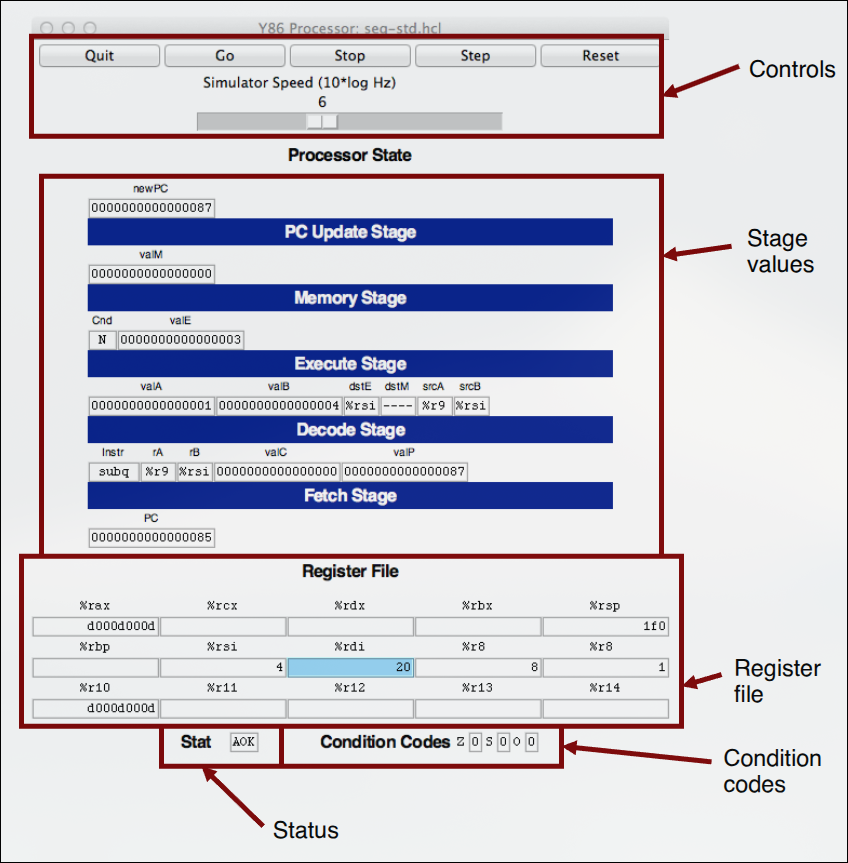
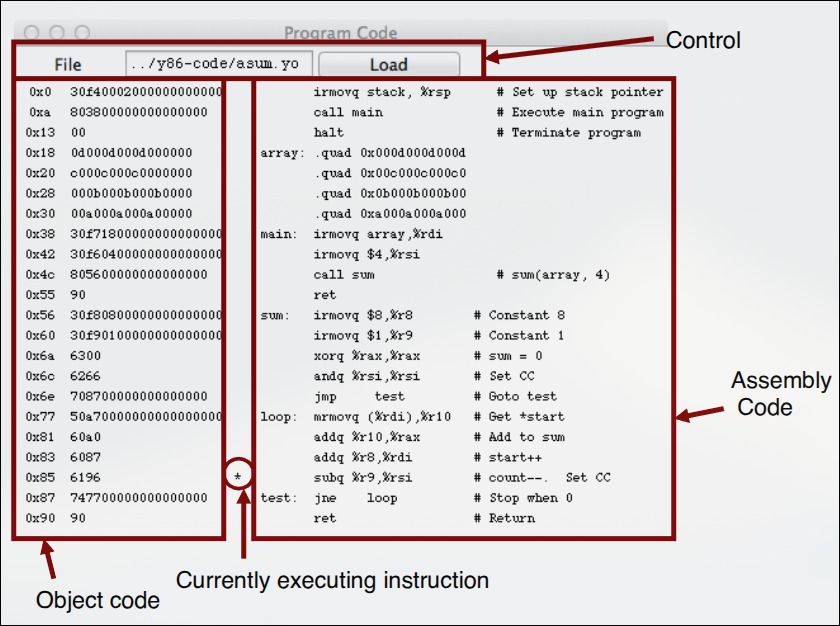
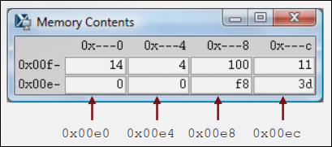
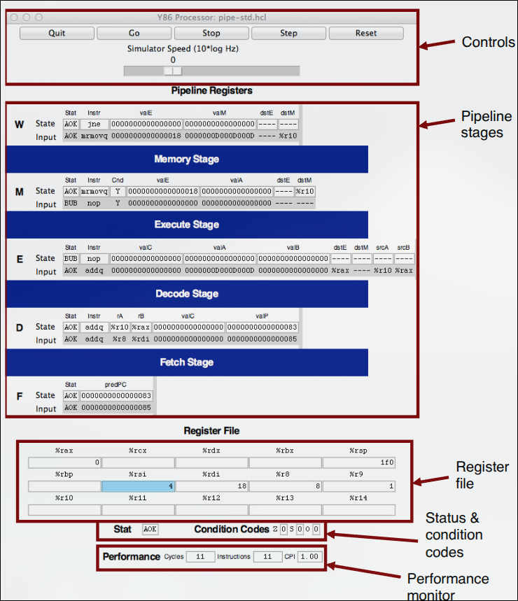
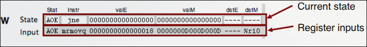
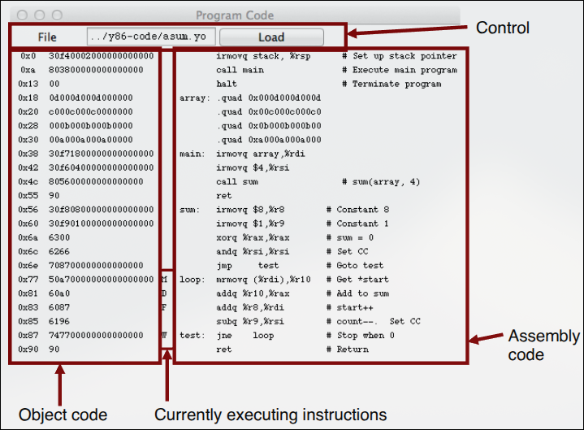

# XJTU-ICS Lab: Arch Lab (Optional)

**本实验为选做实验，无需提交，感兴趣的同学可以自行完成实验。**

## 实验简介

在本实验中，你将学习流水线 Y86-64 处理器的设计与实现，并通过同时优化处理器和基准程序来最大化性能。你可以对基准程序进行任何保持语义不变的转换，也可以对流水线处理器进行增强，或者两者都做。当你完成本实验后，你将对代码与硬件之间如何相互作用并影响程序性能有更深刻的理解。

本实验分为三个部分；在 Part A 中，你将编写一些简单的 Y86-64 程序，并熟悉 Y86-64 工具。在 Part B 中，你将为 SEQ 模拟器扩展一条新指令。这两个部分将为 Part C 做准备。Part C 是本实验的核心，在这一部分中，你将优化 Y86-64 基准程序和处理器设计。

## 实验环境准备

### 远程开发

使用远程开发的同学，可以登陆icsserver服务器完成实验，成功登陆之后在自己的**家目录**
底下可以看到名为**archlab-sp26**的目录。进入目录，就可以开始实验。

如果你缺少这个目录，有下面几种解决方式

- 下载实验压缩包[archlab-sp26.tar](../assets/files/archlab-sp26.tar)
- 访问本次实验的[公有仓库](https://github.com/xjtu-ics/archlab-sp26)并clone到本地（推荐）
- 询问助教或者同学发给你（不推荐）

### 本地开发

本次实验也可以使用本地开发的方式进行，使用本地开发请确保环境中有以下工具

- gcc
- make
- tcl8.6（构建处理器模拟器GUI界面依赖）

实验材料的获取方式：

- 下载实验压缩包[archlab-sp26.tar](../assets/files/archlab-sp26.tar)
- 访问本次实验的[公有仓库](https://github.com/xjtu-ics/archlab-sp26)并clone到本地（推荐）
- 询问助教或者同学发给你（不推荐）

!!!warning
    由于服务器没有图形桌面，因此GUI模式可能无法正常显示。

## 实验前置知识

### Y86-64处理器设计

具体内容详见深入理解计算机系统第四章。

### Y86-64处理器模拟器使用指南

#### 安装

模拟器代码通常以 tar 格式文件 `sim.tar` 的形式发布。将该文件放在你希望安装代码的目录下后，可以执行以下命令：

```bash
linux> tar xf sim.tar
linux> cd sim
linux> make clean
linux> make
```

默认情况下，该过程会生成带有图形用户界面（GUI）的模拟器版本。GUI 版本要求系统安装 Tcl/Tk。如果没有 Tcl/Tk，也可以安装仅支持 TTY 文本模式的版本。TTY 版本会将输出以 ASCII 文本形式打印到标准输出。关于如何生成 GUI 版本和 TTY 版本，请参考源码目录中的 `README` 文件。

`sim` 目录包含以下子目录：

- `misc`：包含一些实用工具的源代码文件，例如：
  - `YAS`：Y86-64 汇编器；
  - `YIS`：Y86-64 指令集模拟器；
  - `HCL2C`：将 HCL 转换为 C 的工具。
  
  该目录还包含 `isa.c` 源文件，所有处理器模拟器都会使用该文件。

- `seq`：包含 SEQ 和 SEQ+ 模拟器的源代码。该目录中也包含用于构建不同版本模拟器的 HCL 文件。具体编译方法请查看该目录中的 `README`。

- `pipe`：包含 PIPE 模拟器的源代码和相关 HCL 文件。具体编译方法请查看该目录中的 `README`。

- `y86-code`：包含多个 Y86-64 汇编示例程序。你可以使用这些基准程序自动测试修改后的模拟器。具体测试方法请查看该目录中的 `README`。本文档后续将以该目录中的 `asum.ys` 程序作为示例。其汇编后的目标代码如图 1 所示。

- `ptest`：包含用于生成系统化回归测试的脚本。这些脚本可以测试不同指令、不同跳转情况以及不同流水线冒险情况，非常适合用于发现处理器实现中的错误。具体使用方法请查看该目录中的 `README`。

下面是一个示例 Y86-64 目标代码文件。该代码位于 `y86-code` 子目录中的 `asum.yo`。

```text
1  | # Execution begins at address 0
2  0x000:                            | .pos 0
3  0x000: 30f40002000000000000      | irmovq stack, %rsp    # Set up stack pointer
4  0x00a: 803800000000000000        | call main             # Execute main program
5  0x013: 00                        | halt                  # Terminate program
6  |
7  | # Array of 4 elements
8  0x018:                            | .align 8
9  0x018: 0d000d000d000000          | array: .quad 0x000d000d000d
10 0x020: c000c000c0000000          | .quad 0x00c000c000c0
11 0x028: 000b000b000b0000          | .quad 0x0b000b000b00
12 0x030: 00a000a000a00000          | .quad 0xa000a000a000
13 |
14 0x038: 30f71800000000000000      | main: irmovq array,%rdi
15 0x042: 30f60400000000000000      | irmovq $4,%rsi
16 0x04c: 805600000000000000        | call sum              # sum(array, 4)
17 0x055: 90                        | ret
18 |
19 | # long sum(long *start, long count)
20 | # start in %rdi, count in %rsi
21 0x056: 30f80800000000000000      | sum: irmovq $8,%r8    # Constant 8
22 0x060: 30f90100000000000000      | irmovq $1,%r9         # Constant 1
23 0x06a: 6300                      | xorq %rax,%rax        # sum = 0
24 0x06c: 6266                      | andq %rsi,%rsi        # Set CC
25 0x06e: 708700000000000000        | jmp test              # Goto test
26 0x077: 50a70000000000000000      | loop: mrmovq (%rdi),%r10 # Get *start
27 0x081: 60a0                      | addq %r10,%rax        # Add to sum
28 0x083: 6087                      | addq %r8,%rdi         # start++
29 0x085: 6196                      | subq %r9,%rsi         # count--. Set CC
30 0x087: 747700000000000000        | test: jne loop        # Stop when 0
31 0x090: 90                        | ret                   # Return
32 |
33 | # Stack starts here and grows to lower addresses
34 0x200:                            | .pos 0x200
35 0x200:                            | stack:
```

#### 实用工具程序

安装完成后，`misc` 目录中包含两个常用程序。

- **YAS：Y86-64 汇编器**

    `YAS` 是 Y86-64 汇编器。它接收扩展名为 `.ys` 的 Y86-64 汇编文件，并生成扩展名为 `.yo` 的目标代码文件。生成的文件包含 ASCII 形式的目标代码，如图 1 所示。

    最方便的调用方式是在 `y86-code` 子目录中使用或创建汇编代码文件。例如，要汇编该目录中的 `asum.ys`，可以执行：

    ```bash
    linux> make asum.yo
    ```

- **YIS：Y86-64 指令集模拟器**

    `YIS` 是 Y86-64 指令集模拟器。它按照 Y86-64 指令集定义执行机器级程序中的指令。

    例如，如果你希望在 `y86-code` 子目录中运行程序 `asum.yo`，可以执行：

    ```bash
    linux> ../misc/yis asum.yo
    ```

    `YIS` 会模拟程序执行，并在终端上打印执行后发生变化的寄存器或内存位置。

#### 处理器模拟器

针对三种处理器 SEQ、SEQ+ 和 PIPE，工具包分别提供了对应的模拟器：`SSIM`、`SSIM+` 和 `PSIM`。

每个模拟器都可以在 TTY 模式或 GUI 模式下运行。

- **TTY 模式**

    TTY 模式使用面向终端的简洁接口，并将所有输出打印到终端。该模式不太适合交互式调试，但可以在几乎所有系统上安装，也适合用于自动化测试。TTY 是所有模拟器的默认模式。

- **GUI 模式**

    GUI 模式提供图形用户界面，便于观察处理器活动并调试修改后的处理器设计。GUI 模式要求系统安装 Tcl/Tk，并通过命令行选项 `-g` 启用。

    注意：GUI 模式只能在模拟器可执行程序所在的目录中运行。例如，`SSIM` 和 `SSIM+` 应在 `seq` 目录中运行，`PSIM` 应在 `pipe` 目录中运行。

三个模拟器均支持若干命令行选项：

- `-h`：打印所有命令行选项的摘要。
- `-g`：以 GUI 模式运行模拟器。默认模式是 TTY。
- `-t`：仅限 TTY 模式。运行处理器模拟器和 ISA 模拟器，并比较二者得到的内存、寄存器文件和条件码结果。如果没有发现差异，则打印：

  ```text
  ISA Check Succeeds.
  ```

  如果发现差异，则输出寄存器文件或内存中不同的字。这个功能对于测试处理器设计非常有用。

- `-l m`：仅限 TTY 模式。设置指令执行上限，最多执行 `m` 条指令后停止。默认上限为 10000 条指令。
- `-v n`：仅限 TTY 模式。设置输出详细程度。`n` 必须在 0 到 2 之间，默认值为 2。

GUI 模式下运行模拟器时，必须在命令行中提供目标代码文件名。在 TTY 模式下，目标代码文件名是可选的；默认情况下，模拟器会从标准输入读取目标代码。

##### SEQ 模拟器

以下是在 `seq` 子目录中调用模拟器的一些典型示例：

```bash
linux> ./ssim -h
linux> ./ssim+ -t < ../y86-code/asum.yo
linux> ./ssim -g ../y86-code/asum.yo
```

含义如下：

1. 第一条命令打印 `SSIM` 的命令行选项摘要。
2. 第二条命令以 TTY 模式运行 `SSIM+`，从标准输入读取 `asum.yo`。模拟器会将得到的寄存器和内存值与 ISA 模拟器的结果进行比较。
3. 第三条命令以 GUI 模式运行 `SSIM`，执行 `y86-code` 子目录中的目标代码文件 `asum.yo`。

在 `pipe` 子目录中，`PSIM` 也可以使用类似方式调用。

在 `seq` 子目录中，可以使用目标代码文件名启动 SEQ 处理器模拟器的 GUI 版本：

```bash
linux> ./ssim -g ../y86-code/asum.yo &
```

命令末尾的 `&` 表示让模拟器在后台运行。

启动后，模拟器会创建三个窗口。


- **SEQ 模拟器主控制面板**

    

    第一个窗口是主控制面板。主控制窗口包含用于控制模拟器的按钮，以及处理器当前状态的相关信息。窗口中各部分含义如下。

    - **控制区**

        窗口顶部的按钮用于控制模拟器：

        - `Quit`：退出模拟器；
        - `Go`：开始运行模拟器；
        - `Stop`：临时停止模拟器；
        - `Step`：执行一条指令后停止；
        - `Reset`：将模拟器恢复到初始状态。

        执行 `Reset` 后，程序计数器会回到地址 0，寄存器清零，除程序外的内存被清空，条件码被设置为：

        ```text
        ZF = 1, SF = 0, OF = 0
        ```

        程序状态被设置为 `AOK`。

        按钮下方的滑块用于控制模拟器运行速度。向右移动滑块会使模拟器运行更快。

    - **阶段值**

        该区域显示当前指令求值过程中不同处理器信号的值。模拟器直接显示指令名称，而不是仅显示 `icode` 和 `ifun` 的数值。类似地，所有寄存器标识符都以寄存器名称显示。如果不需要访问寄存器，则显示为 `----`。

    - **寄存器文件**

        该区域显示 15 个程序寄存器的值。最近一次被更新的寄存器会以浅蓝色高亮显示。

        寄存器内容只有在第一次被设置为非零值之后才会显示。

        需要注意的是，当某条指令写入程序寄存器时，寄存器文件要到下一个时钟周期开始时才会真正更新。因此，你需要让模拟器再单步执行一次，才能看到寄存器更新后的结果。

    - **状态 Stat**

        `Stat` 显示当前正在执行的指令状态。可能的取值如下：

        - `AOK`：没有遇到问题；
        - `ADR`：发生地址错误，例如读取指令、读取数据或写入数据时访问了非法地址。地址不能超过 `0x0FFF`；
        - `INS`：遇到非法指令；
        - `HLT`：遇到 `halt` 指令。

    - **条件码**

        该区域显示三个条件码的值：

        ```text
        ZF, SF, OF
        ```

        需要注意的是，当某条指令改变条件码时，条件码寄存器要到下一个时钟周期开始时才会真正更新。因此，你需要让模拟器再单步执行一次，才能看到条件码的更新。


- **SEQ 模拟器代码显示窗口**

    

    上图所示窗口展示当前模拟器正在执行的目标代码文件。

    窗口中的编辑框显示当前程序的文件名。你可以在该窗口中修改文件名，并点击 `Load` 按钮加载新的程序。

    显示区左侧展示正在执行的目标代码，右侧展示对应的汇编代码文本。中间的星号 `*` 表示当前正在模拟的指令。


- **SEQ 模拟器内存显示窗口**

    

    上图所示窗口显示内存内容。它只显示程序开始执行后发生变化的最小地址和最大地址之间的内存区域。

    每一行显示两个内存字，因此每行共显示 16 字节。每行左侧是该行的“根地址”，其中最低有效十六进制数字用 `-` 表示。每一列对应最低有效地址数字为 `0x0` 和 `0x8` 的字。

    上图中的示例展示的是 `asum.yo` 程序在执行 `sum` 过程时的栈内容。根据已经执行的栈操作可以看到：

    1. `%rsp` 被初始化为 `0x200`；
    2. 对 `main` 的调用将返回地址 `0x013` 压栈，写入地址 `0x01f8`；
    3. `main` 调用 `sum`，将返回地址 `0x055` 写入地址 `0x01f0`。

    因此，内存显示窗口中出现的所有字都可以由这些调用操作解释，同时栈指针被设置为 `0x01f0`。

##### PIPE 模拟器

PIPE 模拟器同样会生成三个窗口。其主控制面板具有与 SEQ 模拟器相同的控制按钮，以及寄存器文件、状态和条件码显示。

面板中间区域显示流水线寄存器的状态。面板底部显示性能监视信息，包括：

- 已模拟的周期数；
- 已完成的指令数；
- 计算得到的 CPI。


- **PIPE 模拟器主控制面板**

    


- **PIPE 模拟器中单个流水线寄存器的显示方式**

    

    如上图所示，每个流水线寄存器都分为两部分显示：

    - 白色框中的上半部分表示流水线寄存器当前保存的值；
    - 灰色背景中的下半部分表示将要输入到该流水线寄存器的值。

    如果该寄存器没有发生 bubble 或 stall，这些输入值将在下一个时钟周期被装入流水线寄存器。

    SEQ 和 PIPE 模拟器中的值流动方式有很大差异：

    - 在 SEQ 中，控制面板显示的是单条指令完整执行后的相关值。每次单步执行都会完成一整条指令。
    - 在 PIPE 中，控制面板显示的是多条指令同时流经流水线的状态。每次单步执行只让每条指令推进一个阶段。


- **PIPE 模拟器代码显示窗口**

    

    上图显示了 PIPE 模拟器的代码窗口。它的格式与 SEQ 的代码窗口类似。

    不同之处在于，SEQ 窗口只使用一个标记表示当前正在执行的指令；而 PIPE 窗口会标出每个流水线阶段中的指令。窗口使用以下字符表示流水线阶段：

    - `F`：Fetch，取指阶段；
    - `D`：Decode，译码阶段；
    - `E`：Execute，执行阶段；
    - `M`：Memory，访存阶段；
    - `W`：Write back，写回阶段。

    PIPE 模拟器也会生成内存内容显示窗口，其格式与 SEQ 模拟器的内存窗口相同。

    上面的主控制面板和代码窗口示例展示了执行图 1 中第 26 到第 30 行循环代码时的流水线状态。此时模拟器已经开始循环的第一次迭代，并且是通过跳转到测试部分进入循环的。各阶段状态如下。

    - **写回阶段**

        初始测试中的 `jne` 指令正在完成写回。

    - **访存阶段**

        `mrmovq` 指令刚刚从地址 `0x018` 读取了值 `0x0D000D000D`。

        可以在流水线寄存器 M 的 `valE` 中看到该地址，也可以在流水线寄存器 W 的 `valM` 输入处看到从内存读取出的值。

    - **执行阶段**

        该阶段中是一个 bubble。这个 bubble 是由于 `mrmovq` 指令和后续 `addq` 指令之间存在 load-use 依赖而插入的。

        可以看到，这个 bubble 的行为类似于一条 `nop` 指令。因此，上图中没有用 `E` 标记的指令。

    - **译码阶段**

        `addq` 指令已经从寄存器 `%rax` 中读出了 `0x0`。它也从寄存器 `%r10` 中读出了 `0x00D`，但转发逻辑使用了刚刚从内存读出的值 `0x0D000D000D` 作为新的 `valA`。

    - **取指阶段**

        一条 `addq` 指令刚刚从地址 `0x083` 取出。新的 PC 预测值为 `0x085`。


流水线的每个阶段都有一个状态字段 `Stat`。该字段表示当前阶段中指令的状态。

常见状态包括：

- `AOK`：没有遇到异常；
- `BUB`：该阶段中是一个 bubble，而不是普通指令；
- `ADR`：访问了非法内存地址；
- `INS`：遇到非法指令编码；
- `PIP`：流水线出现问题，例如某个流水线寄存器的 stall 信号和 bubble 信号同时被设置为 1；
- `HLT`：遇到 `halt` 指令。

当 `ADR`、`INS`、`PIP` 或 `HLT` 到达写回阶段时，模拟器会停止。

将单条指令的状态字段与该指令的其他信息一起在流水线中传递，可以支持精确处理不同的异常条件。

#### 使用建议

下面是一些使用模拟器时的经验建议。

- **熟悉模拟器操作**

    建议先运行 `y86-code` 目录中的示例程序，熟悉模拟器的操作方式。对于小程序，应确保理解每条指令是如何被处理的。

    特别需要观察以下有代表性的情况：

    - 分支预测错误；
    - load-use 互锁；
    - 过程返回。

- **主动查找信号来源**

    调试时需要主动在界面中寻找信息。观察数据转发的效果尤其需要仔细比较。

    例如，流水线寄存器 E 中的 `valA` 信号可能来自 7 种来源，`valB` 可能来自 6 种来源。要确定模拟器选择了哪一个来源，需要将流水线寄存器字段的输入值与所有可能来源进行比较。

    可能的数据来源包括：

    - `R[d_srcA]`：源寄存器由流水线寄存器 E 中 `srcA` 的输入确定。寄存器内容显示在控制面板底部。
    - `R[d_srcB]`：源寄存器由流水线寄存器 E 中 `srcB` 的输入确定。寄存器内容显示在控制面板底部。
    - `D_valP`：流水线寄存器 D 中保存的值。
    - `e_valE`：流水线寄存器 M 的 `valE` 字段输入。
    - `M_valE`：流水线寄存器 M 中保存的值。
    - `m_valM`：流水线寄存器 W 的 `valM` 字段输入。
    - `W_valE`：流水线寄存器 W 中保存的值。
    - `W_valM`：流水线寄存器 W 中保存的值。

- **不要覆盖自己的代码**

    由于数据和代码共享同一地址空间，程序很容易在运行时覆盖自己的代码。一旦覆盖发生，程序在执行被覆盖的指令时可能出现严重混乱。

    因此，应将栈设置在距离代码足够远的位置，以避免栈数据覆盖代码区域。

- **避免使用过大的地址值**

    模拟器不允许访问超过 `0x0FFF` 的地址。

    此外，如果程序修改了跨度很大的内存地址范围，内存显示窗口会变得很难阅读。

- **GUI 模式模拟器的一些注意事项**

    使用 GUI 模式的 `SSIM`、`SSIM+` 和 `PSIM` 时，需要注意以下事项：

    - 必须从模拟器所属目录运行程序。也就是说：
        - 运行 `SSIM` 或 `SSIM+` 时，应位于 `seq` 目录；
        - 运行 `PSIM` 时，应位于 `pipe` 目录。

        这是因为 Tcl 解释器需要根据当前目录定位模拟器配置文件。

    - 如果在 Unix 服务器上使用 GUI 模式，需要初始化 `DISPLAY` 环境变量，例如：

        ```bash
        unix> setenv DISPLAY myhost.edu:0
        ```

    - 在某些 Unix X Window 管理器中，`Program Code` 窗口启动时可能是一个关闭的图标。如果模拟器启动后没有看到该窗口，需要手动点击图标将其展开。

    - 在某些 Microsoft Windows X server 中，`Memory Contents` 窗口不会在内存内容改变时自动调整大小。此时需要手动调整窗口大小才能看到内存内容。

    - 如果让模拟器执行一个无效的 Y86-64 目标文件，模拟器可能会以 segmentation fault 终止。

#### 常用命令速查

- **构建模拟器**

    ```bash
    linux> tar xf sim.tar
    linux> cd sim
    linux> make clean
    linux> make
    ```

- **汇编 Y86-64 程序**

    ```bash
    linux> make asum.yo
    ```

- **使用 YIS 执行程序**

    ```bash
    linux> ../misc/yis asum.yo
    ```

- **查看模拟器帮助**

    ```bash
    linux> ./ssim -h
    ```

- **TTY 模式运行并与 ISA 模拟器比较**

    ```bash
    linux> ./ssim+ -t < ../y86-code/asum.yo
    ```

- **GUI 模式运行 SEQ 模拟器**

    ```bash
    linux> ./ssim -g ../y86-code/asum.yo
    ```

- **GUI 模式运行 PIPE 模拟器**

    ```bash
    linux> ./psim -g ../y86-code/asum.yo
    ```

## Part A

这一部分你将在目录 `sim/misc` 中进行实验。

你的任务是编写并模拟以下三个 Y86-64 程序。这些程序的预期行为由 `examples.c` 中的示例 C 函数定义。请务必在每个程序开头的注释中写上你的姓名和 ID。你可以先使用程序 `YAS` 对它们进行汇编，然后使用指令集模拟器 `YIS` 运行它们，以测试你的程序。

在所有 Y86-64 函数中，你都应该遵循 x86-64 关于函数参数传递、寄存器使用和栈使用的约定。这包括保存和恢复你使用到的任何被调用者保存寄存器（callee-save registers）。

### `sum.ys`：迭代求链表元素之和

编写一个 Y86-64 程序 `sum.ys`，迭代地求一个链表中所有元素的和。你的程序应包含一些用于设置栈结构、调用函数并最终停机的代码。在这个程序中，该函数应是一个 Y86-64 版本的函数 `sum_list`，其功能应等价于的 C 函数 `sum_list`。

`sum_list` C 函数代码如下：

```c
/* linked list element */
typedef struct ELE {
    long val;
    struct ELE *next;
} *list_ptr;

/* sum_list - Sum the elements of a linked list */
long sum_list(list_ptr ls)
{
    long val = 0;
    while (ls) {
        val += ls->val;
        ls = ls->next;
    }
    return val;
}

```

请使用下面这个包含三个元素的链表测试你的程序：

```asm
# Sample linked list
.align 8
ele1:
.quad 0x00a
.quad ele2
ele2:
.quad 0x0b0
.quad ele3
ele3:
.quad 0xc00
.quad 0
```

### `rsum.ys`：递归求链表元素之和

编写一个 Y86-64 程序 `rsum.ys`，递归地求链表元素之和。该代码应与 `sum.ys` 类似，不同之处在于它应使用函数 `rsum_list` 递归地求一组数字的和。

`rsum_list` C 函数代码如下：

```c
/* linked list element */
typedef struct ELE {
    long val;
    struct ELE *next;
} *list_ptr;

/* rsum_list - Recursive version of sum_list */
long rsum_list(list_ptr ls)
{
    if (!ls)
        return 0;
    else {
        long val = ls->val;
        long rest = rsum_list(ls->next);
        return val + rest;
    }
}

```

请使用你在测试 `list.ys` 时使用的同一个三元素链表来测试该程序。

### `copy.ys`：将源块复制到目标块

编写一个程序 `copy.ys`，将一块字从内存的一个区域复制到另一个不重叠的内存区域，并计算所有被复制字的校验和（异或，Xor）。

你的程序应包含设置栈帧、调用函数 `copy_block` 并最终停机的代码。

`copy_block` C 函数代码如下：

```c
/* copy_block - Copy src to dest and return xor checksum of src */
long copy_block(long *src, long *dest, long len)
{
    long result = 0;
    while (len > 0) {
        long val = *src++;
        *dest++ = val;
        result ^= val;
        len--;
    }
    return result;
}
```

请使用以下三元素源块和目标块测试你的程序：

```asm
.align 8
# Source block
src:
.quad 0x00a
.quad 0x0b0
.quad 0xc00
# Destination block
dest:
.quad 0x111
.quad 0x222
.quad 0x333
```

## Part B

这一部分你将在目录 `sim/seq` 中进行实验。

Part B 的任务是扩展 SEQ 处理器，使其支持 `iaddq` 指令。为了添加这条指令，你需要修改文件 `seq-full.hcl`，该文件实现了 教材中描述的 SEQ 版本。此外，它还包含一些你在解答中需要使用的常量声明。

### 构建并测试你的解答

当你完成对 `seq-full.hcl` 文件的修改后，需要基于这个 HCL 文件构建一个新的 SEQ 模拟器实例 `ssim`，然后对它进行测试。

#### 构建新的模拟器

你可以使用 `make` 构建新的 SEQ 模拟器：

```bash
unix> make VERSION=full
```

这会构建一个使用你在 `seq-full.hcl` 中指定的控制逻辑的 `ssim` 版本。为了减少输入量，你也可以在 `Makefile` 中设置 `VERSION=full`。

#### 使用简单 Y86-64 程序测试你的解答

在初始测试时，我们建议你在 TTY 模式下运行一些简单程序，例如 `asumi.yo`，用于测试 `iaddq`，并将结果与 ISA 模拟进行比较：

```bash
unix> ./ssim -t ../y86-code/asumi.yo
```

如果 ISA 测试失败，那么你应在 GUI 模式下单步调试模拟器：

```bash
unix> ./ssim -g ../y86-code/asumi.yo
```

#### 使用基准程序重新测试你的解答

当你的模拟器能够正确执行程序后，你可以在 `../y86-code` 中自动测试它对 Y86-64 基准程序的执行情况：

```bash
unix> (cd ../y86-code; make testssim)
```

这会在基准程序上运行 `ssim`，并通过将得到的处理器状态与高级 ISA 模拟得到的状态进行比较来检查正确性。请注意，这些程序都不会测试新增的指令。你只是要确认你的解答没有给原有指令注入错误。更多细节请参见文件 `../y86-code/README`。

#### 执行回归测试

当你能够正确执行基准程序后，应运行 `../ptest` 中的完整回归测试集。要测试除 `iaddq` 和 `leave` 之外的所有内容，执行：

```bash
unix> (cd ../ptest; make SIM=../seq/ssim)
```

要测试你对 `iaddq` 的实现，执行：

```bash
unix> (cd ../ptest; make SIM=../seq/ssim TFLAGS=-i)
```

关于 SEQ 模拟器的更多信息，请参考 handout 文档 **CS:APP3e Guide to Y86-64 Processor Simulators**（`simguide.pdf`）。

## Part C

这一部分你将在目录 `sim/pipe` 中进行实验。

`ncopy` 函数将一个长度为 `len` 的整数数组 `src` 复制到一个与其不重叠的数组 `dst`，并返回 `src` 中正整数的个数。文件 `pipe-full.hcl` 包含 PIPE 的 HCL 代码副本，并声明了常量 `IIADDQ`。

Part C 的任务是修改 `ncopy.ys` 和 `pipe-full.hcl`，目标是让 `ncopy.ys` 运行得尽可能快。

`sim/pipe/ncopy.c` 代码如下：

```c
/*
 * ncopy - copy src to dst, returning number of positive ints
 * contained in src array.
 */
word_t ncopy(word_t *src, word_t *dst, word_t len)
{
    word_t count = 0;
    word_t val;

    while (len > 0) {
        val = *src++;
        *dst++ = val;
        if (val > 0)
            count++;
        len--;
    }
    return count;
}
```

`sim/pipe/ncopy.ys` 的基准测试程序如下，你需要修改这个程序：

```asm
##################################################################
# ncopy.ys - Copy a src block of len words to dst.
# Return the number of positive words (>0) contained in src.
#
# Include your name and ID here.
#
# Describe how and why you modified the baseline code.
#
##################################################################
# Do not modify this portion
# Function prologue.
# %rdi = src, %rsi = dst, %rdx = len
ncopy:

##################################################################
# You can modify this portion
# Loop header
xorq %rax,%rax # count = 0;
andq %rdx,%rdx # len <= 0?
jle Done # if so, goto Done:

Loop: mrmovq (%rdi), %r10 # read val from src...
rmmovq %r10, (%rsi) # ...and store it to dst
andq %r10, %r10 # val <= 0?
jle Npos # if so, goto Npos:
irmovq $1, %r10
addq %r10, %rax # count++
Npos: irmovq $1, %r10
subq %r10, %rdx # len--
irmovq $8, %r10
addq %r10, %rdi # src++
addq %r10, %rsi # dst++
andq %rdx,%rdx # len > 0?
jg Loop # if so, goto Loop:
##################################################################
# Do not modify the following section of code
# Function epilogue.
Done:
ret
##################################################################
# Keep the following label at the end of your function
End:
```

### 编码规则

你可以自由进行任何修改，但必须满足以下约束：

- 你的 `ncopy.ys` 函数必须适用于任意数组大小。你可能会想通过直接写 64 条 copy 指令，将解答硬编码为只适用于 64 元素数组，但这不是一个好主意，因为我们会根据你的解答在任意数组上的性能进行评分。

- 你的 `ncopy.ys` 函数必须能在 `YIS` 上正确运行。这里的“正确”是指：它必须正确复制 `src` 块，并在 `%rax` 中返回正确的正整数个数。

- 你的 `ncopy` 文件汇编后的版本长度不得超过 1000 字节。你可以使用提供的脚本 `check-len.pl` 检查任意嵌入了 `ncopy` 函数的程序长度：

  ```bash
  unix> ./check-len.pl < ncopy.yo
  ```

- 你的 `pipe-full.hcl` 实现必须通过 `../y86-code` 和 `../ptest` 中的回归测试，不包括用于测试 `iaddq` 的 `-i` 标志。

!!!hint
    - 可以实现`iaddq`指令，该指令可以减少`irmovq`的使用
    - 可以重排指令以减少数据依赖
    - 可以使用循环展开，增加一次循环处理元素的个数
    - 如果你想要达到CPE<7.5的目标，你需要对循环展开后剩余的元素进行合理的处理
    - 当前`pipe-full.hcl`实现了对数据冒险和控制冒险的处理，其中对于加载/使用冒险的处理为暂停流水线。你可以使用数据转发技术避免加载/使用冒险带来的流水线暂停

### 构建并运行你的解答

为了测试你的解答，你需要构建一个调用你的 `ncopy` 函数的驱动程序。我们提供了 `gen-driver.pl` 程序，它可以为任意大小的输入数组生成驱动程序。例如，输入：

```bash
unix> make drivers
```

会构建以下两个有用的驱动程序：

- `sdriver.yo`：一个小型驱动程序，用于在 4 元素小数组上测试 `ncopy` 函数。如果你的解答正确，那么该程序在复制 `src` 数组后，会以寄存器 `%rax` 中的值为 2 的状态停机。

- `ldriver.yo`：一个大型驱动程序，用于在 63 元素较大数组上测试 `ncopy` 函数。如果你的解答正确，那么该程序在复制 `src` 数组后，会以寄存器 `%rax` 中的值为 31（`0x1f`）的状态停机。

每次修改 `ncopy.ys` 程序后，都可以通过输入以下命令重新构建驱动程序：

```bash
unix> make drivers
```

每次修改 `pipe-full.hcl` 文件后，都可以通过输入以下命令重新构建模拟器：

```bash
unix> make psim VERSION=full
```

如果你想同时重新构建模拟器和驱动程序，输入：

```bash
unix> make VERSION=full
```

要在 GUI 模式下用一个小的 4 元素数组测试你的解答，输入：

```bash
unix> ./psim -g sdriver.yo
```

要在一个较大的 63 元素数组上测试你的解答，输入：

```bash
unix> ./psim -g ldriver.yo
```

当你的模拟器能够在这两个块长度上正确运行你的 `ncopy.ys` 版本后，还需要进行以下额外测试。

#### 在 ISA 模拟器上测试你的驱动文件

确认你的 `ncopy.ys` 函数能正确地与 `YIS` 一起工作：

```bash
unix> make drivers
unix> ../misc/yis sdriver.yo
```

#### 使用 ISA 模拟器在一系列块长度上测试你的代码

Perl 脚本 `correctness.pl` 会生成块长度从 0 到某个上限（默认为 65）的驱动文件，外加一些更大的大小。它会模拟这些驱动文件，默认使用 `YIS`，并检查结果。它会生成一个报告，显示每个块长度的状态：

```bash
unix> ./correctness.pl
```

该脚本生成的测试程序中，结果计数会在每次运行时随机变化，因此它比标准驱动程序提供了更严格的测试。

如果你在某个长度 `K` 上得到错误结果，可以为该长度生成一个包含检查代码的驱动文件，并让结果随机变化：

```bash
unix> ./gen-driver.pl -f ncopy.ys -n K -rc > driver.ys
unix> make driver.yo
unix> ../misc/yis driver.yo
```

程序结束时，寄存器 `%rax` 会具有以下值：

| `%rax` 值 | 含义 |
|---|---|
| `0xaaaa` | 所有测试通过。 |
| `0xbbbb` | 计数错误。 |
| `0xcccc` | 函数 `ncopy` 超过 1000 字节。 |
| `0xdddd` | 一些源数据没有被复制到目标位置。 |
| `0xeeee` | 目标区域之前或之后的某个字被破坏。 |

#### 在基准程序上测试你的流水线模拟器

当你的模拟器能够正确执行 `sdriver.ys` 和 `ldriver.ys` 后，应在 `../y86-code` 中用 Y86-64 基准程序测试它：

```bash
unix> (cd ../y86-code; make testpsim)
```

这会在基准程序上运行 `psim`，并将结果与 `YIS` 进行比较。

#### 使用完整回归测试测试你的流水线模拟器

当你能够正确执行基准程序后，应使用 `../ptest` 中的回归测试检查它。例如，如果你的解答实现了 `iaddq` 指令，则执行：

```bash
unix> (cd ../ptest; make SIM=../pipe/psim TFLAGS=-i)
```

#### 使用流水线模拟器在一系列块长度上测试你的代码

最后，你可以在流水线模拟器上运行之前在 ISA 模拟器上进行过的相同代码测试：

```bash
unix> ./correctness.pl -p
```

---

## 评分

本实验共 190 分：Part A 30 分，Part B 60 分，Part C 100 分。

在`grader/`目录中，有三个评分程序：

```bash
unix> ls grader
grade-archlaba.pl  grade-archlabb.pl  grade-archlabc.pl  README
```

你可以分别执行三个评分程序来进行本地测试。

### Part A

Part A 共 30 分，三个 Y86-64 解答程序各 10 分。每个解答程序都会根据正确性进行评分，包括正确处理栈和寄存器，以及与 `examples.c` 中示例 C 函数的功能等价性。

如果grader没有在 `sum.ys` 和 `rsum.ys` 中发现错误，并且它们各自的 `sum_list` 和 `rsum_list` 函数在寄存器 `%rax` 中返回和 `0xcba`，则这两个程序会被认为是正确的。

如果grader没有在 `copy.ys` 中发现错误，并且 `copy_block` 函数在寄存器 `%rax` 中返回和 `0xcba`，将三个 64 位值 `0x00a`、`0x0b` 和 `0xc` 复制到从地址 `dest` 开始的 24 字节区域中，并且不破坏其他内存位置，则该程序会被认为是正确的。

在`archlab-sp26`目录下，执行`make grade-parta`，可以运行评分程序。

评分程序的示例输出如下：

```bash
make grade-parta
./grader/grade-archlaba.pl

Part A: Local Test Report for local

***************
Problem 0: sum.ys
***************
Running yas sum.ys...
Running yis sum.yo...
Stopped in 23 steps at PC = 0x1d.  Status 'HLT', CC Z=1 S=0 O=0
Changes to registers:
%rax:   0x0000000000000000      0x0000000000000cba
%rsp:   0x0000000000000000      0x0000000000000100
%r10:   0x0000000000000000      0x0000000000000c00

Changes to memory:
0x00f8: 0x0000000000000000      0x000000000000001d

Score: 10/10

***************
Problem 1: rsum.ys
***************
Running yas rsum.ys...
Running yis rsum.yo...
Stopped in 40 steps at PC = 0x1d.  Status 'HLT', CC Z=0 S=0 O=0
Changes to registers:
%rax:   0x0000000000000000      0x0000000000000cba
%rsp:   0x0000000000000000      0x0000000000000100

Changes to memory:
0x00c0: 0x0000000000000000      0x0000000000000c00
0x00c8: 0x0000000000000000      0x000000000000007a
0x00d0: 0x0000000000000000      0x00000000000000b0
0x00d8: 0x0000000000000000      0x000000000000007a
0x00e0: 0x0000000000000000      0x000000000000000a
0x00e8: 0x0000000000000000      0x000000000000007a
0x00f8: 0x0000000000000000      0x000000000000001d

Score: 10/10

***************
Problem 2: copy.ys
***************
Running yas copy.ys...
Running yis copy.yo...
Stopped in 37 steps at PC = 0x31.  Status 'HLT', CC Z=1 S=0 O=0
Changes to registers:
%rax:   0x0000000000000000      0x0000000000000cba
%rsp:   0x0000000000000000      0x0000000000000100
%rsi:   0x0000000000000000      0x0000000000000068
%rdi:   0x0000000000000000      0x0000000000000050
%r10:   0x0000000000000000      0x0000000000000c00
%r11:   0x0000000000000000      0x0000000000000001

Changes to memory:
0x0050: 0x0000000000000111      0x000000000000000a
0x0058: 0x0000000000000222      0x00000000000000b0
0x0060: 0x0000000000000333      0x0000000000000c00
0x00f8: 0x0000000000000000      0x0000000000000031

Score: 10/10

PARTA_SCORES = 10:10:10

```

评分程序会比较最终结果寄存器(%rax)的值是否与预期结果相同，每通过一个程序测试就会获得10分。

### Part B

这一部分共 35 分：

- 10 分：你对 `iaddq` 指令所需计算过程的描述。
- 10 分：通过 `y86-code` 中的基准回归测试，以验证你的模拟器仍能正确执行基准程序套件。
- 15 分：通过 `ptest` 中关于 `iaddq` 的回归测试。

在`archlab-sp26`目录下，执行`make grade-partb`，可以运行评分程序。

评分程序的示例输出如下：

```bash
make grade-partb
./grader/grade-archlabb.pl

Part B: Local Test Report for seq-full.hcl

**********
Part 1: Building simulator using /home/jndu/code/project/archlab/archlab-handout/sim/seq/seq-full.hcl...
**********

**********
Part 2: Benchmark regression tests
**********
make[1]: Entering directory '/tmp/archlabb-3931426/sim/y86-code'
Makefile:42: warning: ignoring prerequisites on suffix rule definition
Makefile:45: warning: ignoring prerequisites on suffix rule definition
Makefile:48: warning: ignoring prerequisites on suffix rule definition
Makefile:51: warning: ignoring prerequisites on suffix rule definition
../misc/yas asum.ys
../seq/ssim -t asum.yo > asum.seq
../misc/yas asumr.ys
../seq/ssim -t asumr.yo > asumr.seq
../misc/yas cjr.ys
../seq/ssim -t cjr.yo > cjr.seq
../misc/yas j-cc.ys
../seq/ssim -t j-cc.yo > j-cc.seq
../misc/yas poptest.ys
../seq/ssim -t poptest.yo > poptest.seq
../misc/yas pushquestion.ys
../seq/ssim -t pushquestion.yo > pushquestion.seq
../misc/yas pushtest.ys
../seq/ssim -t pushtest.yo > pushtest.seq
../misc/yas prog1.ys
../seq/ssim -t prog1.yo > prog1.seq
../misc/yas prog2.ys
../seq/ssim -t prog2.yo > prog2.seq
../misc/yas prog3.ys
../seq/ssim -t prog3.yo > prog3.seq
../misc/yas prog4.ys
../seq/ssim -t prog4.yo > prog4.seq
../misc/yas prog5.ys
../seq/ssim -t prog5.yo > prog5.seq
../misc/yas prog6.ys
../seq/ssim -t prog6.yo > prog6.seq
../misc/yas prog7.ys
../seq/ssim -t prog7.yo > prog7.seq
../misc/yas prog8.ys
../seq/ssim -t prog8.yo > prog8.seq
../misc/yas ret-hazard.ys
../seq/ssim -t ret-hazard.yo > ret-hazard.seq
grep "ISA Check" *.seq
asum.seq:ISA Check Succeeds
asumr.seq:ISA Check Succeeds
cjr.seq:ISA Check Succeeds
j-cc.seq:ISA Check Succeeds
poptest.seq:ISA Check Succeeds
prog1.seq:ISA Check Succeeds
prog2.seq:ISA Check Succeeds
prog3.seq:ISA Check Succeeds
prog4.seq:ISA Check Succeeds
prog5.seq:ISA Check Succeeds
prog6.seq:ISA Check Succeeds
prog7.seq:ISA Check Succeeds
prog8.seq:ISA Check Succeeds
pushquestion.seq:ISA Check Succeeds
pushtest.seq:ISA Check Succeeds
ret-hazard.seq:ISA Check Succeeds
rm asum.seq asumr.seq cjr.seq j-cc.seq poptest.seq pushquestion.seq pushtest.seq prog1.seq prog2.seq prog3.seq prog4.seq prog5.seq prog6.seq prog7.seq prog8.seq ret-hazard.seq
make[1]: Leaving directory '/tmp/archlabb-3931426/sim/y86-code'

Passed 16/16 benchmark regression tests
Score: 10/10

**********
Part 3: Extensive regression tests for iaddq
**********
make[1]: Entering directory '/tmp/archlabb-3931426/sim/ptest'
./optest.pl -s ../seq/ssim -i
Simulating with ../seq/ssim
  All 58 ISA Checks Succeed
./jtest.pl -s ../seq/ssim -i
Simulating with ../seq/ssim
  All 96 ISA Checks Succeed
./ctest.pl -s ../seq/ssim -i
Simulating with ../seq/ssim
  All 22 ISA Checks Succeed
./htest.pl -s ../seq/ssim -i
Simulating with ../seq/ssim
  All 756 ISA Checks Succeed
make[1]: Leaving directory '/tmp/archlabb-3931426/sim/ptest'

Passed 932/932 tests
Score: 15/15

**********
Part 4: Extensive regression tests for leave
**********
make[1]: Entering directory '/tmp/archlabb-3931426/sim/ptest'
./optest.pl -s ../seq/ssim -l
Unknown option: l
Simulating with ../seq/ssim
  All 49 ISA Checks Succeed
./jtest.pl -s ../seq/ssim -l
Unknown option: l
Simulating with ../seq/ssim
  All 64 ISA Checks Succeed
./ctest.pl -s ../seq/ssim -l
Unknown option: l
Simulating with ../seq/ssim
  All 22 ISA Checks Succeed
./htest.pl -s ../seq/ssim -l
Unknown option: l
Simulating with ../seq/ssim
  All 600 ISA Checks Succeed
make[1]: Leaving directory '/tmp/archlabb-3931426/sim/ptest'

Passed 735/735 tests
Score: 15/15

PARTB_SCORES = 10:15:15
```


### Part C

Part C 共 100 分。如果你的 `ncopy.ys` 代码或你修改后的模拟器没有通过前面描述的任意测试，你将不会获得这一部分的任何分数。

- 20 分：`ncopy.ys` 和 `pipe-full.hcl` 文件头部注释中的描述，以及这些实现的质量。

- 60 分：性能。要获得这部分分数，你的解答必须是正确的，如前文定义：`ncopy` 能够在 `YIS` 上正确运行，并且 `pipe-full.hcl` 通过 `y86-code` 和 `ptest` 中的所有测试。

我们将用 **cycles per element（CPE）** 表示你的函数性能。也就是说，如果模拟代码复制一个包含 `N` 个元素的块需要 `C` 个周期，那么 CPE 为：

```text
CPE = C / N
```

PIPE 模拟器会显示完成程序所需的总周期数。在标准 PIPE 模拟器上运行的 `ncopy` 基线版本，在一个 63 元素大数组上复制 63 个元素需要 897 个周期，因此：

```text
CPE = 897 / 63 = 14.24
```

由于一些周期用于设置对 `ncopy` 的调用以及在 `ncopy` 内部设置循环，你会发现不同块长度会得到不同的 CPE 值。通常来说，随着 `N` 增大，CPE 会下降。因此，我们将通过计算块长度从 1 到 64 的 CPE 平均值来评估你的函数性能。

你可以使用 `pipe` 目录中的 Perl 脚本 `benchmark.pl`，在一系列块长度上运行对 `ncopy.ys` 代码的模拟，并计算平均 CPE。只需运行命令：

```bash
unix> ./benchmark.pl
```

即可查看结果。例如，`ncopy` 函数的基线版本 CPE 值范围为 29.00 到 14.27，平均值为 15.18。请注意，这个 Perl 脚本不会检查答案的正确性。请使用脚本 `correctness.pl` 检查正确性。

你应该能够达到低于 9.00 的平均 CPE。如果你的平均 CPE 为 `c`，则你在这一性能部分的分数 `S` 为：

```text
当 c > 10.5 时：
    S = 0

当 7.50 <= c <= 10.50 时：
    S = 20 * (10.5 - c)

当 c < 7.50 时：
    S = 60
```

默认情况下，`benchmark.pl` 和 `correctness.pl` 会编译并测试 `ncopy.ys`。可以使用 `-f` 参数指定不同的文件名。`-h` 标志会给出完整的命令行参数列表。

在`archlab-sp26`目录下，执行`make grade-partc`，可以运行评分程序。

评分程序的示例输出如下：

```bash
make grade-partc
./grader/grade-archlabc.pl

Part C: Local Test Report for local

Part 1: Building simulator


**********
Part 2: Benchmark regression tests on psim
**********
make[1]: Entering directory '/tmp/archlabc-local.3947694/sim/y86-code'
Makefile:42: warning: ignoring prerequisites on suffix rule definition
Makefile:45: warning: ignoring prerequisites on suffix rule definition
Makefile:48: warning: ignoring prerequisites on suffix rule definition
Makefile:51: warning: ignoring prerequisites on suffix rule definition
../misc/yas asum.ys
../pipe/psim -t asum.yo > asum.pipe
../misc/yas asumr.ys
../pipe/psim -t asumr.yo > asumr.pipe
../misc/yas cjr.ys
../pipe/psim -t cjr.yo > cjr.pipe
../misc/yas j-cc.ys
../pipe/psim -t j-cc.yo > j-cc.pipe
../misc/yas poptest.ys
../pipe/psim -t poptest.yo > poptest.pipe
../misc/yas pushquestion.ys
../pipe/psim -t pushquestion.yo > pushquestion.pipe
../misc/yas pushtest.ys
../pipe/psim -t pushtest.yo > pushtest.pipe
../misc/yas prog1.ys
../pipe/psim -t prog1.yo > prog1.pipe
../misc/yas prog2.ys
../pipe/psim -t prog2.yo > prog2.pipe
../misc/yas prog3.ys
../pipe/psim -t prog3.yo > prog3.pipe
../misc/yas prog4.ys
../pipe/psim -t prog4.yo > prog4.pipe
../misc/yas prog5.ys
../pipe/psim -t prog5.yo > prog5.pipe
../misc/yas prog6.ys
../pipe/psim -t prog6.yo > prog6.pipe
../misc/yas prog7.ys
../pipe/psim -t prog7.yo > prog7.pipe
../misc/yas prog8.ys
../pipe/psim -t prog8.yo > prog8.pipe
../misc/yas ret-hazard.ys
../pipe/psim -t ret-hazard.yo > ret-hazard.pipe
grep "ISA Check" *.pipe
asum.pipe:ISA Check Succeeds
asumr.pipe:ISA Check Succeeds
cjr.pipe:ISA Check Succeeds
j-cc.pipe:ISA Check Succeeds
poptest.pipe:ISA Check Succeeds
prog1.pipe:ISA Check Succeeds
prog2.pipe:ISA Check Succeeds
prog3.pipe:ISA Check Succeeds
prog4.pipe:ISA Check Succeeds
prog5.pipe:ISA Check Succeeds
prog6.pipe:ISA Check Succeeds
prog7.pipe:ISA Check Succeeds
prog8.pipe:ISA Check Succeeds
pushquestion.pipe:ISA Check Succeeds
pushtest.pipe:ISA Check Succeeds
ret-hazard.pipe:ISA Check Succeeds
rm asum.pipe asumr.pipe cjr.pipe j-cc.pipe poptest.pipe pushquestion.pipe pushtest.pipe prog1.pipe prog2.pipe prog3.pipe prog4.pipe prog5.pipe prog6.pipe prog7.pipe prog8.pipe ret-hazard.pipe
make[1]: Leaving directory '/tmp/archlabc-local.3947694/sim/y86-code'

Passed 16/16 benchmark regression tests

**********
Part 3: Extensive regression tests
**********
make[1]: Entering directory '/tmp/archlabc-local.3947694/sim/ptest'
./optest.pl -s ../pipe/psim 
Simulating with ../pipe/psim
  All 49 ISA Checks Succeed
./jtest.pl -s ../pipe/psim 
Simulating with ../pipe/psim
  All 64 ISA Checks Succeed
./ctest.pl -s ../pipe/psim 
Simulating with ../pipe/psim
  All 22 ISA Checks Succeed
./htest.pl -s ../pipe/psim 
Simulating with ../pipe/psim
  All 600 ISA Checks Succeed
make[1]: Leaving directory '/tmp/archlabc-local.3947694/sim/ptest'

Passed 735/735 extensive regression tests

**********
Part 4: Correctness of ncopy program running on ISA simulator
**********
Simulating with instruction set simulator yis
        ncopy
0       OK
1       OK
2       OK
3       OK
4       OK
5       OK
6       OK
7       OK
8       OK
9       OK
10      OK
11      OK
12      OK
13      OK
14      OK
15      OK
16      OK
17      OK
18      OK
19      OK
20      OK
21      OK
22      OK
23      OK
24      OK
25      OK
26      OK
27      OK
28      OK
29      OK
30      OK
31      OK
32      OK
33      OK
34      OK
35      OK
36      OK
37      OK
38      OK
39      OK
40      OK
41      OK
42      OK
43      OK
44      OK
45      OK
46      OK
47      OK
48      OK
49      OK
50      OK
51      OK
52      OK
53      OK
54      OK
55      OK
56      OK
57      OK
58      OK
59      OK
60      OK
61      OK
62      OK
63      OK
64      OK
128     OK
192     OK
256     OK
68/68 pass correctness test

**********
Part 5: Correctness of ncopy program running on pipeline simulator
**********
Simulating with pipeline simulator psim
        ncopy
0       OK
1       OK
2       OK
3       OK
4       OK
5       OK
6       OK
7       OK
8       OK
9       OK
10      OK
11      OK
12      OK
13      OK
14      OK
15      OK
16      OK
17      OK
18      OK
19      OK
20      OK
21      OK
22      OK
23      OK
24      OK
25      OK
26      OK
27      OK
28      OK
29      OK
30      OK
31      OK
32      OK
33      OK
34      OK
35      OK
36      OK
37      OK
38      OK
39      OK
40      OK
41      OK
42      OK
43      OK
44      OK
45      OK
46      OK
47      OK
48      OK
49      OK
50      OK
51      OK
52      OK
53      OK
54      OK
55      OK
56      OK
57      OK
58      OK
59      OK
60      OK
61      OK
62      OK
63      OK
64      OK
128     OK
192     OK
256     OK
68/68 pass correctness test

**********
Part 6: Performance test
**********
        ncopy
0       23
1       27      27.00
2       34      17.00
3       38      12.67
4       45      11.25
5       49      9.80
6       56      9.33
7       60      8.57
8       67      8.38
9       71      7.89
10      78      7.80
11      82      7.45
12      97      8.08
13      101     7.77
14      108     7.71
15      112     7.47
16      119     7.44
17      123     7.24
18      130     7.22
19      134     7.05
20      141     7.05
21      145     6.90
22      152     6.91
23      156     6.78
24      167     6.96
25      171     6.84
26      178     6.85
27      182     6.74
28      189     6.75
29      193     6.66
30      200     6.67
31      204     6.58
32      211     6.59
33      215     6.52
34      222     6.53
35      226     6.46
36      237     6.58
37      241     6.51
38      248     6.53
39      252     6.46
40      259     6.47
41      263     6.41
42      270     6.43
43      274     6.37
44      281     6.39
45      285     6.33
46      292     6.35
47      296     6.30
48      307     6.40
49      311     6.35
50      318     6.36
51      322     6.31
52      329     6.33
53      333     6.28
54      340     6.30
55      344     6.25
56      351     6.27
57      355     6.23
58      362     6.24
59      366     6.20
60      377     6.28
61      381     6.25
62      388     6.26
63      392     6.22
64      399     6.23
Average CPE     7.48
Score   60.0/60.0

PARTC_SCORES = 60.0
```

该解答通过了所有回归测试，并且平均CPE达到了7.48，因此获得了所有的分数。
