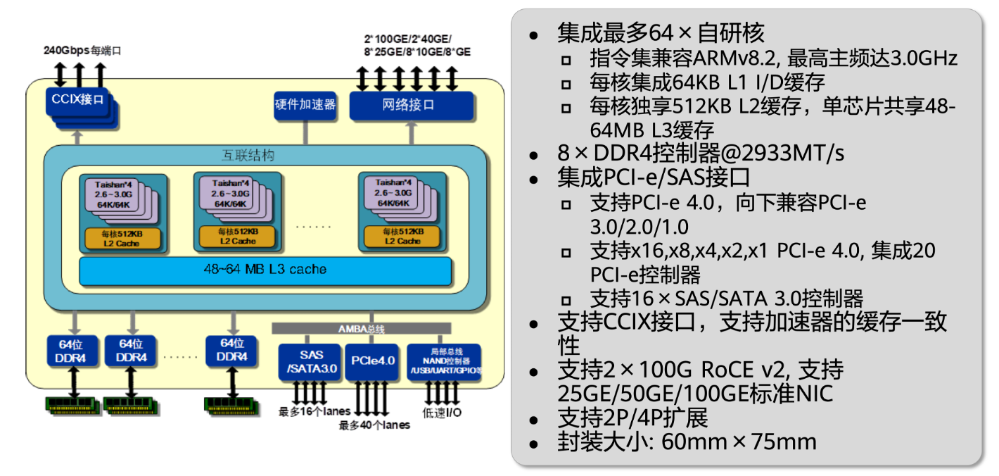
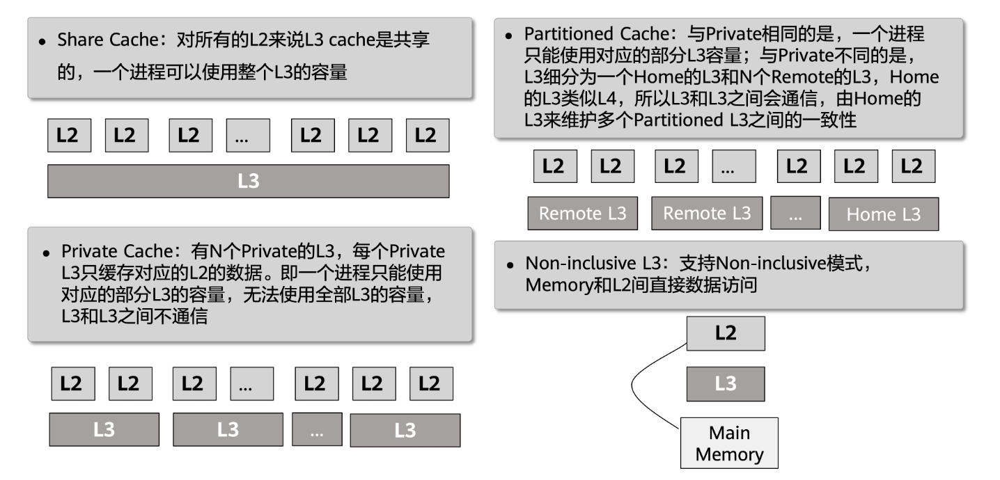

# Part A：基于鲲鹏架构的三级Cache模拟器

在Part A中，你需要实现一个三级Cache模拟器。
以华为鲲鹏（Kunpeng）为代表的现代处理器在数据中心和高性能计算领域展现了强大的实力。
真实的鲲鹏处理器采用了经典的多级缓存架构，包括核心私有的独立L1指令与数据缓存、核心私有（或簇内共享）的L2缓存，以及多核共享的L3缓存，以此来缓解“内存墙”问题带来的性能瓶颈。
为了帮助大家深入理解这一不断变化的计算架构，本次实验正是基于鲲鹏处理器的缓存层级进行的高度抽象。
你的模拟器将会读取 `traces-*` 目录下的trace文件，然后开始运行，从而达到模拟鲲鹏CPU多级cache访问的效果。


## 鲲鹏处理器Cache架构简介
根据架构特性，鲲鹏物理芯片上集成了强大的敏捷缓存系统与互联结构，主要具备以下硬件规格与Cache组织模式：

### 基础硬件规格



- 核心集成：单芯片集成最多64个自研核心（指令集兼容ARMv8.2，最高主频达3.0GHz）。
- L1 Cache：每核集成64KB的L1指令缓存（I-cache）和64KB的L1数据缓存（D-cache）。
- L2 Cache：每核独享512KB的L2缓存。
- L3 Cache：单芯片内的所有核心共享48MB到64MB的大容量L3缓存。

### L3 Cache的工作模式


为了适应不同的业务需求和多核性能优化，架构支持对L3 Cache进行多种敏捷的模式配置：
- Share Cache（共享模式）：对所有的L2来说L3 cache是共享的，一个进程可以使用整个L3的容量。
- Private Cache（私有模式）：有N个Private的L3，每个Private L3只缓存对应的L2的数据。即一个进程只能使用对应的部分L3的容量，无法使用全部L3的容量，L3和L3之间不通信。
- Partitioned Cache（分区模式）：与Private相同的是，一个进程只能使用对应的部分L3容量；与Private不同的是，L3细分为一个Home的L3和N个Remote的L3，Home的L3类似L4，所以L3和L3之间会通信，由Home的L3来维护多个Partitioned L3之间的一致性。
- Non-inclusive L3（非包含模式）：支持Non-inclusive模式，Memory和L2间可以直接数据访问。


## 三级缓存结构的基本配置

本次实验中，需要实现的三级cache结构如下：


其中：

- L1分为L1D（数据读写）和L1I（指令读取）两个分离的cache，并且L1I是**只读**的。
- L1和L2为**每个核心私有**
- L2为unfied cache，也就是会**同时存储指令和数据**
- L3为unfied cache，且**所有核心共享**

!!!note
    上述结构是真实鲲鹏CPU内部多级cache结构的简化版。在本次实验中，**你可以假设所有指令都是 one by one 执行**，且**只有一个核心**。换句话说，你**无需考虑多线程并发访问和核心之间缓存一致性**的问题。


每个cache的具体配置如下：

- L1D(I) cache
    - size: 64B
    - set: 4
    - associativity: 2-way
    - cache line size: 8B
    - write policy: write back + write allocate
- L2 cache
    - size: 256B
    - set: 8
    - associativity: 4-way
    - cache line size: 8B
    - write poliy: write back + write allocate
    - inclusion policy: inclusive
- L3 cache
    - size: 2KB
    - set: 16
    - associativity: 8-way
    - cache line size: 16B
    - write policy: write back + write allocate
    - inclusion policy: inclusive

!!!warning
    再阅读下一部分之前，请确保自己已经**完全理解**上述cache配置中的每一行配置要求。如果你感受到任何的困惑，建议立即停止并且阅读**实验前置知识**一节。

## Trace文件简介

在`cachelab-sp26`目录下的`traces`目录中有许多以`.trace`结尾的文件，我们称它们为trace文件。trace文件中是一系列访存日志，它作为Part A中Cache模拟器的输入，用来判断程序的正确性。trace文件是通过`Valgrind`工具生成的。

!!!note
    `Valgrind`是一款用于内存调试、内存泄漏检测以及性能分析的软件开发工具。

    例如：

    ```shell
    $ valgrind --log-fd=1 --tool=lackey -v --trace-mem=yes ls -l
    ```

    以上命令可以输出执行`ls -l`命令时实际产生的所有内存访问日志。

trace文件的格式如下：

```plain
I 0400d7d4,8
 M 0421c7f0,4
 L 04f6b868,8
 S 7ff0005c8,8
```

每一行代表一个内存访问指令，每个指令可能会有一次或两次的内存访问，每一行的格式如下：

```plain
[space]operation address,size
```

- `operation`表示内存访问指令的类型，分为4种：
  - `I`表示一条指令的加载（Instruct）
  - `L`表示数据读取（Load）
  - `S`表示数据存储（Store）
  - `M`表示数据修改（Modify）（**实际上是一次Load再加一次Store**）
- `address` 表示一个64位**十六进制**内存地址。
- `size`表示本次内存访问的字节数。

!!!note
    **注意**：在trace文件中，`I`前面**没有空格**，但是`M`，`L`，`S`前面**一定有一个空格**。

## 实验内容及步骤


不知道大家在看到实验目录下那么多的文件之后，是否感受到头昏眼花了呢？不过，不用担心，为了减轻同学们的负担，助教们已经将大部分代码框架搭建好了，大家只需要在给定的框架中填充代码即可~

在Part A中，你**唯一需要**完成的文件是`cache-impl.c`文件，除此之外，你**严禁修改其他任何文件，包括删除现有文件或者自行创建新文件**。否则可能造成**本地评测和提交之后的评测结果不一致，或者无法编译通过**，产生的**一切后果由自己承担**。⚠️

正如前面提到的，在Part A中你需要实现一个三级cache模拟器。作为参考标准，我们提供了一个已经正确实现的cache模拟器作为参考标准，以**二进制可执行程序**的形式发放，命名为`csim-ref-partA`。

!!!warning
    假如你缺少这个程序，或者程序损坏无法运行，请立刻联系助教进行处理。

这个程序接受多个命令行参数，可以通过下面这条命令查看其用法：

```bash
$ ./csim-ref-partA -h
usage: ./csim-ref-partA -t trace_file [-h] [-n] [-v] [-l level] [-d] [-i] [-s set] [-b breakpoint] 
options: 
-h, --help          print this
-o, --output        output file
-t, --trace         input trace file (required)
-c, --cache-levels  number of cache levels to build [1-3] (default: 3)
-n, --snapshot      print cache snapshot
-b, --breakpoint    print cache info after one specified access, note that it can not be enabled in verbose mode
-v, --verbose       print information after each cache access, instead of print snapshot at the end
-l, --level         which cache level [l1--1, l2--2, l3--3] to print (only can be specified when [-n] is enabled)
-d, --data          data cache (must be specified if level == 1)
-i, --instruction   instruction cache (must be specified if level == 1 )
-s, --set           which cache set (index start from 0) to print (only can be specified when [-l] is enabled)
```

下面是对上述参数的具体解释：

- `-h`：可选，打印帮助信息
- `-n`：可选， 打印快照信息
- `-o`：可选，指定输出信息的文件路径，默认是标准输出
- `-c`：可选，指定当前构建的最大Cache层级，可选值有`1`、`2`、`3`，默认为`3`
- `-v`：可选，以详细模式打印信息，这种模式下，相关的统计量和快照信息会在每次进行一次cache访问之后打印，默认是全部trace访问完成之后打印。
- `-t`: **必选**，指定输入trace文件的路径
- `-b`：可选，断点功能，将会打印在某一次cache访问之后的cache状态，注意这个参数**不能和`-v`同时使用**

为了测试cache的正确性以及方便大家debug，助教们为大家写好了打印快照的函数，可以打印所有cache line中的tag，valid和dirty字段的值。

打印快照的功能通过`-n`参数开启，默认在完成所有cache访问后，打印所有cache line的信息。

如果你不想要所有的cache line内容，可以在**开启快照之后（即指定了-n参数）**指定打印哪个cache，以及哪个cache的哪个set，这些通过**参数+值**的形式来实现：

- `-l <level>`：可选，指定打印哪一级cache，可选值为[1, 2, 3]，分别代表L1, L2和L3 cache
- `[-d -i]`：可选，分别表示dcache和icache，当level指定为1时，你需要**至少指定一个参数**
- `-s <set>`：可选，指定打印某一个cache set，使用此参数时，你**必须先指定level**

下面是一个典型的运行结果：

```bash
$ ./csim-ref-partA -t traces-l1-basic/l1Devict.trace
L1-d cache hits:0 misses:4 evictions:2
L1-i cache hits:0 misses:0 evictions:0
L2 cache hits:2 misses:3 evictions:0
L3 cache hits:0 misses:3 evictions:0
```

如果只想构建一级Cache：
```bash
$ ./csim-ref-partA -t ./traces-l1-basic/l1Devict.trace -c 1
L1-d cache hits:0 misses:4 evictions:2
L1-i cache hits:0 misses:0 evictions:0
L2 cache hits:0 misses:0 evictions:0
L3 cache hits:0 misses:0 evictions:0
```


使用`-n`开启快照，并且使用`-v`打印详细信息。

```bash
$ ./csim-ref-partA -vnt traces-l1-basic/l1Devict.trace
0: S 0 8
L1-d cache hits:0 misses:1 evictions:0
L1-i cache hits:0 misses:0 evictions:0
L2 cache hits:0 misses:1 evictions:0
L3 cache hits:0 misses:1 evictions:0
l1-d cache[0][0]: valid=1, dirty=1, tag=0
l1-d cache[0][1]: valid=0, dirty=0, tag=0
l1-d cache[1][0]: valid=0, dirty=0, tag=0
l1-d cache[1][1]: valid=0, dirty=0, tag=0
l1-d cache[2][0]: valid=0, dirty=0, tag=0
l1-d cache[2][1]: valid=0, dirty=0, tag=0
l1-d cache[3][0]: valid=0, dirty=0, tag=0
l1-d cache[3][1]: valid=0, dirty=0, tag=0
l1-i cache[0][0]: valid=0, dirty=0, tag=0
l1-i cache[0][1]: valid=0, dirty=0, tag=0
l1-i cache[1][0]: valid=0, dirty=0, tag=0
l1-i cache[1][1]: valid=0, dirty=0, tag=0
l1-i cache[2][0]: valid=0, dirty=0, tag=0
l1-i cache[2][1]: valid=0, dirty=0, tag=0
l1-i cache[3][0]: valid=0, dirty=0, tag=0
l1-i cache[3][1]: valid=0, dirty=0, tag=0
l2 cache[0][0]: valid=1, dirty=0, tag=0
l2 cache[0][1]: valid=0, dirty=0, tag=0
...
l2 cache[7][0]: valid=0, dirty=0, tag=0
l2 cache[7][1]: valid=0, dirty=0, tag=0
l2 cache[7][2]: valid=0, dirty=0, tag=0
l2 cache[7][3]: valid=0, dirty=0, tag=0
l3 cache[0][0]: valid=1, dirty=0, tag=0
l3 cache[0][1]: valid=0, dirty=0, tag=0
l3 cache[0][2]: valid=0, dirty=0, tag=0
l3 cache[0][3]: valid=0, dirty=0, tag=0
l3 cache[0][4]: valid=0, dirty=0, tag=0
l3 cache[0][5]: valid=0, dirty=0, tag=0
...
l3 cache[15][6]: valid=0, dirty=0, tag=0
l3 cache[15][7]: valid=0, dirty=0, tag=0
1: L 20 8
```

这会在每一次访问之后打印具体的**访问指令**，当前的**统计量**和**cache的快照**等。

如果你只对L2感兴趣，可以指定打印L2的某一个set：

```bash
$ ./csim-ref-partA -vnt traces-l1-basic/l1Devict.trace -l 2 -s 4
0: S 0 8
L1-d cache hits:0 misses:1 evictions:0
L1-i cache hits:0 misses:0 evictions:0
L2 cache hits:0 misses:1 evictions:0
L3 cache hits:0 misses:1 evictions:0
l2 cache[4][0]: valid=0, dirty=0, tag=0
l2 cache[4][1]: valid=0, dirty=0, tag=0
l2 cache[4][2]: valid=0, dirty=0, tag=0
l2 cache[4][3]: valid=0, dirty=0, tag=0
1: L 20 8
L1-d cache hits:0 misses:2 evictions:0
L1-i cache hits:0 misses:0 evictions:0
L2 cache hits:0 misses:2 evictions:0
L3 cache hits:0 misses:2 evictions:0
l2 cache[4][0]: valid=1, dirty=0, tag=0
l2 cache[4][1]: valid=0, dirty=0, tag=0
l2 cache[4][2]: valid=0, dirty=0, tag=0
l2 cache[4][3]: valid=0, dirty=0, tag=0
2: L 40 8
L1-d cache hits:0 misses:3 evictions:1
L1-i cache hits:0 misses:0 evictions:0
L2 cache hits:1 misses:3 evictions:0
L3 cache hits:0 misses:3 evictions:0
l2 cache[4][0]: valid=1, dirty=0, tag=0
l2 cache[4][1]: valid=0, dirty=0, tag=0
l2 cache[4][2]: valid=0, dirty=0, tag=0
l2 cache[4][3]: valid=0, dirty=0, tag=0
3: L 0 8
L1-d cache hits:0 misses:4 evictions:2
L1-i cache hits:0 misses:0 evictions:0
L2 cache hits:2 misses:3 evictions:0
L3 cache hits:0 misses:3 evictions:0
l2 cache[4][0]: valid=1, dirty=0, tag=0
l2 cache[4][1]: valid=0, dirty=0, tag=0
l2 cache[4][2]: valid=0, dirty=0, tag=0
l2 cache[4][3]: valid=0, dirty=0, tag=0
```

如果你需要全部的cache信息，而只对某一次访问结束之后的cache信息感兴趣，你可以使用`-b`参数指定breakpoint：

```bash
$ ./csim-ref-partA -nt traces-l1-basic/l1Devict.trace -l 2 -s 4 -b 2
2: L 40 8
L1-d cache hits:0 misses:3 evictions:1
L1-i cache hits:0 misses:0 evictions:0
L2 cache hits:1 misses:3 evictions:0
L3 cache hits:0 misses:3 evictions:0
l2 cache[4][0]: valid=1, dirty=0, tag=0
l2 cache[4][1]: valid=0, dirty=0, tag=0
l2 cache[4][2]: valid=0, dirty=0, tag=0
l2 cache[4][3]: valid=0, dirty=0, tag=0
L1-d cache hits:0 misses:4 evictions:2
L1-i cache hits:0 misses:0 evictions:0
L2 cache hits:2 misses:3 evictions:0
L3 cache hits:0 misses:3 evictions:0
l2 cache[4][0]: valid=1, dirty=0, tag=0
l2 cache[4][1]: valid=0, dirty=0, tag=0
l2 cache[4][2]: valid=0, dirty=0, tag=0
l2 cache[4][3]: valid=0, dirty=0, tag=0
```

这将会打印行数为2（行数从0开始）的指令访问之后的cache信息以及全部访问结束之后的cache信息。

当然，上述参数可以自由组合，不过注意要遵守其约定。

!!!note
    你实现的模拟器将被编译为可执行文件`csim`，可以对csim使用相同的操作进行测试，例如：
    ```bash
    ./csim -nt traces-l1-basic/l1Devict.trace -l 2 -s 4 
    ```

简单来说，你的任务就是实现这样一个模拟器，从命令行读取trace文件进行模拟，要求是输出需要和我们提供的标准cache模拟器**完全一致**

有关文件读取和命令行参数的处理，以及cache结构的声明，助教们已经帮大家完成了：

有关cache的结构，大家可以查看`cachelab.h`文件：

```c
// cachelab.h
...

#define L1_SET_NUM 4
#define L1_LINE_NUM 2
#define L1_CACHELINE_SIZE 8

#define L2_SET_NUM 8
#define L2_LINE_NUM 4
#define L2_CACHELINE_SIZE 8

#define L3_SET_NUM 16
#define L3_LINE_NUM 8
#define L3_CACHELINE_SIZE 16

#define ADDRESS_LENGTH 64

...

typedef struct {
  bool valid;
  bool dirty;
  uint64_t tag;
  uint64_t latest_used; // for LRU
} CacheLine;

extern CacheLine l1dcache[L1_SET_NUM][L1_LINE_NUM];
// L1 Instruction Cache
extern CacheLine l1icache[L1_SET_NUM][L1_LINE_NUM];
// L2 Unified Cache
extern CacheLine l2ucache[L2_SET_NUM][L2_LINE_NUM];
// L3 Unified Cache
extern CacheLine l3ucache[L3_SET_NUM][L3_LINE_NUM];

...
```

里面声明了有关cache配置的一些宏定义和cache line的结构体，以及使用二维数组的方式来组织cache，在开始实验之前，你需要读懂并理解这个文件中有关cache定义的内容，且**禁止修改任何内容**。

在`csim.c`中，助教们已经帮大家写好了命令行参数处理的逻辑，以及文件读取的逻辑，具体如下：

```c
// csim.c
...

  cacheInit(opt_cache_levels); // implemented in cache-impl.c

  char buf[BUF_SIZE];
  uint64_t addr;
  uint32_t len;
  char op;
  while (fgets(buf, BUF_SIZE, trace_fp)) {
    if (buf[0] == 'I') {
      op = buf[0];
    } else if (buf[0] == ' ') {
      op = buf[1];
    } else {
      continue; // ignore empty lines and lines begin with '='
    }
    sscanf(buf + 3, "%lx,%d", &addr, &len);
    // to be implemented in csim.c
    if (verbose == 1 || (current_line == breakpoint)) {
      fprintf(out, "%ld: %c %lx %d\n", current_line, op, addr, len);
    }
    cacheAccess(op, addr, len); // implemented in cache-impl.c
    if (verbose == 1 || (current_line == breakpoint)) {
      printSummary(l1d_hits, l1d_misses, l1d_evictions, l1i_hits, l1i_misses,
                   l1i_evictions, l2_hits, l2_misses, l2_evictions, l3_hits,
                   l3_misses, l3_evictions);
      if (snapshot == 1) {
        printSnapshot();
      }
    }
    current_line++;
  }
...
```

具体而言，上述代码首先通过`cacheInit()`函数初始化cache，然后循环读取trace文件的每一行，并且提取出cache访问的一些必要信息，最后调用函数`cacheAccess()`真正访问cache，这两个函数定义在`cache-impl.c`中。

和上述一样，在开始之前，你需要完全理解上述逻辑（不必是整个`csim.c`文件），特别是`cacheInit()`和`cacheAccess()`接口的定义，并且**禁止修改有关这个文件里面的任何内容**。

`cacheInit` 函数接受一个整型参数，用于指定当前需要构建的最大 Cache 层级。
参数含义如下：

- 传入 `1`：仅构建 L1 Cache（单级缓存）；
- 传入 `2`：构建 L1 + L2 Cache（二级缓存）；
- 传入 `3`：构建 L1 + L2 + L3 Cache（三级缓存）。

也就是说，该参数指定的是 Cache 层级的**上限**，所有不超过该层级的 Cache 都会被一并初始化。
调用该函数后，所有已构建的 cache line 的 Valid Bit 将被清零，
Tag 字段与数据块内容也会被重置为初始状态。

!!!note
    实际上，C语言的全局变量在被加载到内存时，如果没有初始化，会被**默认初始化为0**。因此，对于cacheInit函数，你可以什么都不做，但是这个函数放在这的目的就是为了告诉大家初始化的重要性。

`cacheAccess`函数接受三个参数，参数的定义为：

- 第一个参数为访问类型，是一个`char`类型的参数，具体取值和trace文件中的类型相同，为[`I`, `S`, `L`，`M`]其中的一个。
- 第二个参数为访问地址，它是**trace文件中的地址的十进制表示**的结果
- 第三个参数为一次访问的长度，也就是字节数量

最后，终于迎来了我们的主角，`cache-impl.c`。简单来说，你只需要完成这个文件预留的两个函数`cacheInit()`和`cacheAccess()`即可。

为了给同学们自由的发挥空间，助教们仅给出了函数接口，而没有限制具体的实现方法。注意，在这个文件中，**你不可以修改上述两个函数的接口定义（也就是变量类型，个数等），也不可以修改有关cache的12个统计量的定义以及指示当前cache最大层级的全局变量定义**，但是，你**可以在这个文件中添加任何需要的头文件，并且定义任何你需要的数据结构和函数**。

```c
// cache-impl.c
#include "cachelab.h"
#include <stdint.h>
// feel free to include any files you need above

int l1d_hits = 0;
int l1d_misses = 0;
int l1d_evictions = 0;
int l1i_hits = 0;
int l1i_misses = 0;
int l1i_evictions = 0;
int l2_hits = 0;
int l2_misses = 0;
int l2_evictions = 0;
int l3_hits = 0;
int l3_misses = 0;
int l3_evictions = 0;
int cache_levels = 0;

// you can add your own data structures and functions below

// you are not allowed to modify the declaration of this function
void cacheInit(int levels) {
  // TODO
}

// you are not allowed to modify the declaration of this function
void cacheAccess(char op, uint64_t addr, uint32_t len) {
  // TODO
}
```

## 三级cache模拟器访问路径

要注意的是，你需要实现的三级cache模拟器必须保证**严格的包含关系（见[实验前置知识一节](./lab4.md#实验前置知识)）**，并且需要和标准的cache模拟器输出相同。因此，你实现的cache访问流程必须遵循下面的要求：

假设当前需要在 Cache 中查询某一内存地址中的数据，完整的访问流程如下：

1. **地址解析与逐层查找。** 根据目标内存地址，按照每一层 Cache 的结构参数（line size、set 数量），将地址拆分为 **tag**、**set index**、**block offset** 三个字段，然后从最高层（L1）开始逐层向下查找。

2. **判断是否命中。** 在当前层 Cache 中，用 set index 定位到对应的 Set，遍历该 Set 内所有 way：若存在某条 cache line 的 valid 位为 1 且 tag 字段与地址的 tag 匹配，则**命中（Hit）**，跳转到**第 7 步**；否则，继续访问下一级 Cache 或内存。

3. **向上逐层加载数据。** 当在某级 Cache 或内存中找到目标数据后，需要将其**递归地加载**到该层以上的所有 Cache 中（由低层向高层依次填入）。

4. **在目标 Set 中寻找空位。** 将数据加载到某一层时，先根据该层的 Cache 参数计算数据所属的 Set。检查该 Set 中是否存在 invalid 的 cache line：若存在**一个或多个** invalid line，**选择下标最小的一个**作为写入位置，跳转到**第 7 步**；若该 Set 已满（所有 line 均为 valid），进入第 5 步。

5. **驱逐（Eviction）。** Set 已满时，使用 **LRU 算法**选出最近最少使用的一条 cache line 作为 **victim**。在覆写 victim 之前，需要先完成以下操作：首先执行**第 6 步（Back Invalidation）**，确保所有更高层级的 Cache 中不再持有 victim 的数据；然后检查 victim 自身的 dirty 位，若为 1，则将其数据**写回（Write-back）**到下一级 Cache（或内存），并将下一级对应位置的 dirty 位置 1。

6. **Back Invalidation（反向无效化）。** 由于 **inclusive policy** 要求低层 Cache 的内容必须是高层 Cache 内容的超集，驱逐 victim 前必须保证所有更高层级的 Cache 中不再持有 victim 对应的数据。

    具体过程为：从当前层向上逐层查找 victim 对应的 cache line；若在某一高层 Cache 中找到了匹配的 valid line，则从**该数据所在的最高层 Cache** 开始，向下依次执行 evict 操作——将该 cache line 的 valid 位**置为 invalid**，若该 line 的 dirty 位为 1，先将其数据**写回到下一级 Cache** 并将下一级对应位置的 dirty 位置 1——逐层向下重复，直到回到触发 back invalidation 的那一层为止。

7. **更新元数据。** 将目标数据写入选定的 cache line 后，设置该 line 的 **tag** 字段为目标地址的 tag，更新 **LRU** 字段以标记为最近使用，并将 **valid** 位置为 1。

8. **处理写操作。** 若本次访问是**写操作**（Store 或 Modify），还需将该 cache line 的 **dirty** 位置为 1，表示数据已被修改，与下级存储内容不一致。

如果看完上述描述仍然感到困惑，不用担心——理解 Cache 最好的方式莫过于亲手跟着一个例子走一遍。
为此，助教们特地准备了一份演示样例，其 Cache 与内存的组织结构如下图所示。

> 为便于说明，本样例采用**全相联（Fully Associative）**结构，
> 且同一 Cache Set 内，cache line 的编号从左到右依次增大。


cache的访问trace依次为：

- Read a
- Read b
- Read a
- Write b
- Read c
- Write a
- Read d
- Read c
- Write b
- Write c
- Read e
- Read f

!!!note
    在这个简单的例子中，你可以假设每个变量会占用整个cache line，并且三级cache的cache line大小是一样的。换句话说，读取变量a放入cache的时候，a的数据宽度和cache line的大小是一致的。

我们**强烈建议**大家在正式开始写代码之前，自己把上述的过程**完整的画一遍**，特别是注意cache访问中**访问顺序（序号），LRU的设置，evict的过程，cache miss时的处理流程**，以及back invalidation的过程。助教组设计了一个[可交互式的网页](../assets/files/cache_trace.html)作为参考，有任何疑惑，欢迎上piazza进行提问。


<!-- ???todo
    将这部分建议改为单独一章——代码设计策略@rouge3877 -->
## 代码设计策略

在开始编码实验之前，我们希望在这里给出一些**可能有用**的建议。希望能够帮助你理清思路，避免常见陷阱。

### 逻辑抽象

事实上，每一个层级的cache对于内存读写指令的操作极为相似。具体而言，每一级cache对于内存读写指令的操作大致如下：

- 获取某地址对应的tag,set,block信息
- 根据以上信息寻找对应cache line
- 根据寻找结果进行对应处理（hit, miss, evict）
- 如果需要访问下一级cache，则传入需要处理的地址

不难发现，上述过程可以抽象为一个**递归**算法，递归深度由设置的最大层级决定。

当然实际的情况可能更复杂，需要使用递归的设计可能不止一处，上述说明旨在提示你可以利用**递归**算法大大简化你的代码。

### 可利用的简化假设

以下假设可以帮助你大幅简化实现逻辑：

- CPU通过指令直接READ的cache层级只有L1DCache、L1ICache，直接WRITE的cache层级只有L1DCache，其余部分都应该由Cache控制器完成。也就是说，调用`cacheAccess`函数时，首先应当访问L1级Cache，其余部分自行实现。
- 对于单次cache访问，数据不会跨越两个cache line，因此你可以**忽略`cacheAccess`函数中的第三个参数**。
- 你可以假设指令和数据不会访问同一块内存，换句话说，你可以假设L2中的某个cache line**不会同时出现**在L1D cache和L1I cache中。
- 本次实验仅要求模拟cache访问，因此你**无需关心具体的写入数据**。
- 实际上，block字段在本次实验中**可以忽略**，你需要自己分析并理解可以这么做的原因。

### 初始化

- 在访问cache之前，你需要正确的初始化所有的cache line，换句话说，你需要把所有的字段全部初始化为0。

### inclusive性质保证

- 为了保证多级Cache中inclusive的性质，你可以使用[assert](https://en.cppreference.com/w/c/error/assert.html)语句对应该满足的条件进行断言。

### 地址解析与位运算

- 你可以使用位运算相关技巧从传入的地址中提取出tag，set，block等信息。
- 你可以使用位运算相关技巧根据tag，set，block的信息拼接出内存地址。
- 需要注意的是，由于每层的cache配置不同，因此相同地址在不同层的cache解析得到的(tag, set, block)也不同，你需要在实现的时候考虑到这一点。

### 访问类型处理

- 对于`M`类型的访问，你可以等价的将他看作为**一次读取和一次写入**。
- 需要注意的是，L2和L3 cache会**同时包含指令和数据**（unified），你需要仔细思考其产生的影响，**尤其是在back invalidation的时候**。

### LRU算法与Cache Line选择

- 在加载一条cache line时，你需要在当前cache set中找出一条可用的cache line。换句话说，你需要找到**一条valid字段为false**的cache line。如果有多条可用的cache line，你需要选择**下标最小的一个**。
- 如果不存在invalid的cache line来容纳新的数据，这时候你需要**严格使用LRU算法**来找到需要evict的cache line。
- 你可以简单使用循环的方式来暴力实现LRU，而不考虑复杂度的问题，为此，你可以维护一个全局时钟并且仔细的设置cache line结构中的latest_used字段。
- 你可以自由的选择全局时钟的实现方式，比如使用**全局计数器作逻辑时钟**，或者**使用[`clock_gettime()`](https://www.man7.org/linux/man-pages/man3/clock_gettime.3.html)等函数精确化时钟**，测试**不会考察**你的全局时钟实现方式。
- 你在进行evict的时候，**无需对evict的cache line的LRU字段进行改动**（实际上大部分情况这个cache line会直接被新的数据覆盖，届时LRU将被设置）。
- 你需要在每次**成功访问**一条cache line之后设置LRU字段。成功访问包括：写入/读取**命中**，或者是**从下级缓存加载了相应的cache line之后**的读取/写入操作。

### 先Fetch后Evict

在发生conflict miss时，你需要严格遵守**先fetch，后evict**的过程，即先访问下一级缓存或者内存得到数据所在的cache line，再选择需要evict的cache line，这**可能会影响LRU设置的顺序**。

考虑一个例子，假如某个时刻全局时钟为10，L1发生conflict miss，L2 hit，你需要：

1. 首先访问L2，由于L2 hit，设置L2中对应的cache line的LRU为10
2. 将cache line返回给L1，假设L1需要evict的cache line是dirty的，你需要将其首先写回L2；由于inclusive policy，这是100% hit的，因此设置L2中对应的cache line的LRU为11
3. 最后将需要的cache line放置在L1经evict空出的位置上，然后设置对应的LRU为12

### Eviction与脏数据写回

- 在evict一条cache line时，你需要考虑dirty字段的影响，换句话说，如果dirty为true，你需要在加载新的cache line之前，将旧的cache line写回到下一级cache（或内存）。如果dirty为false，你可以简单的将这条cache line丢弃。
- 本次实验要求上一级cache的内容一定存在于下一级cache中，这叫做inclusive policy。你需要时刻保证这一条性质，并且好好利用它。
- 受限于inclusive policy，写回脏数据的过程实际上是**100% hit**的，你需要合理的安排代码顺序实现这一点。
- 根据上一条，write back产生的时机实际上**和evict的发生时刻强相关**，**和evictions的修改时机无关**。简单来说，你**需要在每次evict一条cache line时判断是否需要触发写回下一级的过程**。

### Back Invalidation（回溯失效）

- 如果你需要从L2 evict某个cache line，假设这个cache line也存在于L1，那么你需要首先将L1中对应的cache line进行evict，这个过程叫做back invalidation。如果L1中的数据是dirty的，你需要首先将其写回L2，并且需要仔细处理L2的evict过程。
- 如果你需要从L3 evict一个cache line，你也需要分别将L1和L2中对应的cache line进行evict。在此过程中，你需要**好好思考evict的顺序**，以保证inclusive的性质。
- 注意，不同级别的缓存cache line的大小可能不一样。具体而言，当较低级 Cache 的 block 大小大于较高级 Cache 时，在对较低级 Cache 中某一 cache line 执行 back invalidation 时，需要对该 cache line 所覆盖地址范围内的所有较高级 Cache 的 cache line 一并进行失效处理。

### 统计量更新

- 在每次访问某个cache时，你需要对这个cache的三个统计量（hits, misses, evictions）进行更新，包括对**L1的读取/写入，对L2的读取，对L3的读取，L1写回脏数据到L2，L2写回到L3**等。
- 在本次实验中，你需要将evictions的值理解为**发生conflict miss的次数**，而**不是cache line发生evict的次数**，这是一个命名上的失误。基于这一点，evictions的值需要在发生**conflict miss**时（即通过LRU算法evict cache line时）进行修改，而**无需在back invalidation的过程中evict cache line时进行修改**。
- 当你处理write miss时，需要首先访问下一级缓存（或者内存）以获取cache line，然后再写入这条cache line。在此过程中，你需要仔细思考对于下一级缓存应该**以什么类型进行访问**。

## 本地测试

为合理控制难度梯度，Lab4A 将针对不同最大层级的 Cache 和不同类型的 Trace 分别进行测试，
具体分值占比如下：

- **1 级 Cache**：占总分的 **80%**，测试 Trace 包括 `traces-l1-basic`、`traces-mixed`、
  `traces-data-intensive`、`traces-hard`
- **2 级 Cache**：占总分的 **10%**，测试 Trace 包括 `traces-l2-basic`、`traces-mixed`、
  `traces-data-intensive`、`traces-hard`
- **3 级 Cache**：占总分的 **10%**，测试 Trace 包括 `traces-l3-basic`、`traces-mixed`、
  `traces-data-intensive`、`traces-hard`

各类 Trace 的说明如下：

- **`traces-l1-basic/`、`traces-l2-basic/`、`traces-l3-basic/`**：
  共包含 10 个**手工构造（human-made）**的 Trace，每个文件通常只有几行，
  但覆盖了 Cache 访问的大多数典型路径，适合用于基础功能验证。

- **`traces-mixed/`**：
  包含 3 个综合型 Trace，行数略多于 `*-basic/` 系列，但不超过 200 行，
  用于测试多种访问模式的混合场景。

- **`traces-data-intensive/`**：
  包含来自 10 个常见数据密集型负载的 Trace，已剔除指令访问，**仅保留数据访问**，
  行数从数千行到十几万行不等，用于测试 Cache 在大规模数据访问下的表现。

- **`traces-hard/`**：
  包含来自 10 个真实负载的 Trace，**同时包含指令访问和数据访问**，
  行数从数万行到一百多万行不等，是难度最高的测试集。

各层级与各类 Trace 的详细分值映射如下表所示：

| 层级 | 测试类型 | Trace 目录 | 分值 | 层级总分 |
|------|----------|------------|------|----------|
| L1 | Basic | `traces-l1-basic/` | 20 | 400 |
| L1 | Mixed | `traces-mixed/` | 20 | 400 |
| L1 | Data Intensive | `traces-data-intensive/` | 12 | 400 |
| L1 | Hard | `traces-hard/` | 14 | 400 |
| L2 | Basic | `traces-l2-basic/` | 5 | 50 |
| L2 | Mixed | `traces-mixed/` | 5 | 50 |
| L2 | Data Intensive | `traces-data-intensive/` | 1 | 50 |
| L2 | Hard | `traces-hard/` | 1 | 50 |
| L3 | Basic | `traces-l3-basic/` | 5 | 50 |
| L3 | Mixed | `traces-mixed/` | 5 | 50 |
| L3 | Data Intensive | `traces-data-intensive/` | 1 | 50 |
| L3 | Hard | `traces-hard/` | 1 | 50 |

测试使用 `./test-csim` 运行，可以添加`-h`参数查看该程序所能接受的命令行参数。
在测试之前请先使用`make`将程序编译为可执行文件。

```bash
$ ./test-csim -h
usage: ./test-csim [-hr] [-c <level>]
options:
  -h    print this help message.
  -r    enable random test.
  -c    specify the number of cache levels (1, 2, or 3) to test. Default is 3.
```

各参数的含义如下：

- `-h`：可选参数，不附带值，输出帮助信息。
- `-r`：可选参数，不附带值，开启随机测试模式。
- `-c <level>`：可选参数，附带一个整数值，用于指定本次测试的最大 Cache 层级
  （可选值为 `1`、`2`、`3`），默认值为 `3`，即默认构建并测试全部三级 Cache。

测试过程中，脚本首先根据 `-c` 指定的最大层级构建对应的 Cache 结构，
随后依次执行所有对应 Trace 文件中的访问序列。
在**每个 Trace 文件的全部访问指令执行完毕后**，
脚本会读取并比对 Cache 的三项统计量：
**命中次数（hit）**、**缺失次数（miss）** 和 **替换次数（eviction）**，
你的模拟器输出须与参考模拟器**完全一致**，方可得分。

下面是一个参考的输出：

```bash
$ ./test-csim -c 2

========== Testing cache level 1 ==========

Start testing l1-basic traces...
Testcase                                     Lines     Result    Random    Score     
-----------------------------------------------------------------------------------
traces-l1-basic/l1Ievict.trace               5         PASS      IGNORE    20/20     
traces-l1-basic/l1Dhit.trace                 4         PASS      IGNORE    20/20     
traces-l1-basic/l1Ihit.trace                 5         PASS      IGNORE    20/20     
traces-l1-basic/l1Devict.trace               3         PASS      IGNORE    20/20     
-----------------------------------------------------------------------------------
Total Score: 80 / 80
    4 passed,     0 failed,     4 total

...

========== Testing cache level 2 ==========

Start testing l2-basic traces...
Testcase                                     Lines     Result    Random    Score     
-----------------------------------------------------------------------------------
traces-l2-basic/l2evict.trace                7         PASS      IGNORE    5/5   
traces-l2-basic/l1missl2hit.trace            5         PASS      IGNORE    5/5     
traces-l2-basic/backinvalidation.trace       23        FAIL      IGNORE    0/5      
  Details for trace <traces-l2-basic/backinvalidation.trace>
                          Your simulator           Reference simulator
     Level      Hits    Misses    Evicts      Hits    Misses    Evicts
      L1 D         4        19        17         4        19        15
      L1 I         0         0         0         0         0         0
        L2         7        19        15        10        16        12
        L3         0         0         0         0         0         0
-----------------------------------------------------------------------------------
Total Score: 10 / 15
    2 passed,     1 failed,     3 total

Start testing mixed traces...
Testcase                                     Lines     Result    Random    Score     
-----------------------------------------------------------------------------------
traces-mixed/mixed-3.trace                   128       FAIL      IGNORE    0/5      
  Details for trace <traces-mixed/mixed-3.trace>
                          Your simulator           Reference simulator
     Level      Hits    Misses    Evicts      Hits    Misses    Evicts
      L1 D        35        93        85        35        93        82
      L1 I        13        19        11        13        19        10
        L2        57       109        77        59       107        75
        L3         0         0         0         0         0         0
traces-mixed/mixed-1.trace                   40        PASS      IGNORE    5/5     
traces-mixed/mixed-2.trace                   90        FAIL      IGNORE    0/5      
  Details for trace <traces-mixed/mixed-2.trace>
                          Your simulator           Reference simulator
     Level      Hits    Misses    Evicts      Hits    Misses    Evicts
      L1 D        20        60        52        20        60        52
      L1 I        18        12         7        17        13         6
        L2        71        43        15        71        44        16
        L3         0         0         0         0         0         0
-----------------------------------------------------------------------------------
Total Score: 5 / 15
    1 passed,     2 failed,     3 total

...

Testing cache simulator done. Total scores: 420 / 500
Totally 2.823617 seconds passed.
```

上述输出拿到了420分，下面具体解释一下这个输出结果：

- 本次测试指定 `-c 2`，因此将依次对最大层级为 **1 级**和 **2 级**的 Cache 进行测试。
- **Result** 列显示每条 Trace 的测试结果（`PASS` / `FAIL`）。
- 每一行对应一个 Trace 文件的测试，最右侧一列为该 Trace 的得分。
- **Lines** 列显示每个 Trace 文件包含的访问指令总行数。
- 只有当你的模拟器在该 Trace 上输出的**全部统计量**（共 4 个 Cache × 3 项 = 12 个统计量）
  与参考模拟器**完全一致**时，才能获得该 Trace 的分数。
- 若某条 Trace 测试 **FAIL**，程序将自动打印你的模拟器与参考模拟器的输出结果，供你逐项比对排查。
- 每完成一个 `traces-*` 目录下所有 Trace 的测试，程序将打印该部分的小计得分；
  待所有部分测试完毕后，程序将在末尾打印 **Part A 总得分**，即为本次 CacheLab 的最终得分。

测试程序的输出还有Random一栏，这是用于随机测试，他将在每个trace中随机打入断点查看状态（实际上，现在的实现是**伪随机数**，也就是每次运行打入断点的位置是一样的），开启随机测试之后，你需要**额外**通过随机测试，才能拿到对应的分数。可以通过`-r（--random）`参数来开启：

```bash
$ ./test-csim -c 2 -r

========== Testing cache level 1 ==========

Start testing l1-basic traces...
Testcase                                     Lines     Result    Random    Score     
-----------------------------------------------------------------------------------
traces-l1-basic/l1Ievict.trace               5         PASS      PASS      20/20     
traces-l1-basic/l1Dhit.trace                 4         PASS      PASS      20/20     
traces-l1-basic/l1Ihit.trace                 5         PASS      PASS      20/20     
traces-l1-basic/l1Devict.trace               3         PASS      PASS      20/20     
-----------------------------------------------------------------------------------
Total Score: 80 / 80
    4 passed,     0 failed,     4 total

Start testing mixed traces...
Testcase                                     Lines     Result    Random    Score     
-----------------------------------------------------------------------------------
traces-mixed/mixed-3.trace                   128       PASS      PASS      20/20     
traces-mixed/mixed-1.trace                   40        PASS      PASS      20/20     
traces-mixed/mixed-2.trace                   90        PASS      PASS      20/20     
...

Total Score: 80 / 80
   10 passed,     0 failed,    10 total

========== Testing cache level 2 ==========

Start testing l2-basic traces...
Testcase                                     Lines     Result    Random    Score     
-----------------------------------------------------------------------------------
traces-l2-basic/l2evict.trace                7         PASS      PASS      5/5     
traces-l2-basic/l1missl2hit.trace            5         PASS      PASS      5/5     
traces-l2-basic/backinvalidation.trace       23        FAIL      FAIL      0/5      
  Details for random_test of trace <traces-l2-basic/backinvalidation.trace> at line 21
                          Your simulator           Reference simulator
     Level      Hits    Misses    Evicts      Hits    Misses    Evicts
      L1 D         4        18        16         4        18        14
      L1 I         0         0         0         0         0         0
        L2         7        18        14        10        15        11
        L3         0         0         0         0         0         0
  Details for trace <traces-l2-basic/backinvalidation.trace>
                          Your simulator           Reference simulator
     Level      Hits    Misses    Evicts      Hits    Misses    Evicts
      L1 D         4        19        17         4        19        15
      L1 I         0         0         0         0         0         0
        L2         7        19        15        10        16        12
        L3         0         0         0         0         0         0
-----------------------------------------------------------------------------------
Total Score: 10 / 15
    2 passed,     1 failed,     3 total

...

Testing cache simulator done. Total scores: 420 / 500
Totally 2.753828 seconds passed.
```

开启随机测试之后，在Random一栏会显示PASS或者FAIL（否则为IGNORE），同时在FAIL时会相应的输出打入断点的那一行的详细信息，供你进行比对。

!!!tip
    - 你应该首先保证最基础的400分，也就是通过最大层级为1的所有测试，一级Cache的实现较为简单，你应当首先完成此任务
    - 你应该**灵活使用**前面介绍过的参数进行debug；你也可以修改**你需要的文件**进行debug，如添加`printf`、修改结构体定义以存放你自己的调试信息等方式，但在本地测试时需要保证除`cache-impl.c`文件的其他文件不被修改，最终评分按照标准代码框架进行评测
    - 你可以将输出**重定向**到临时文件中以进行debug，注意，产生的输出文件可能会很大，尤其是开启了**快照**的情况下，请提前预留足够的磁盘空间（大约30-50G）
    - **禁止打表**，我们在最后测试的时候会**随机设置断点（会和你自己进行的随机测试设置的断点不同）**来检查你的程序是否正确，这也是测试输出的**Random**一栏，在开启Random测试后，你需要额外通过random的检查来拿到满分
    - 如果你想确保万无一失，可以使用`-vt`参数并和我们的参考模拟器进行比对，这会在每一次cache访问之后输出cache的状态（也就是12个统计量）。如果完全一致，那随机测试就一定可以通过
    - 你需要注意超时的问题，我们在./test-csim中设置了90秒超时，也就是说，你的程序需要在90秒内通过**所有trace**的测试（一般正确实现的程序只需要**几秒钟**即可跑完所有测试），否则你只能得到在**超时之前PASS的trace**的分数。

下面是一个典型的超时结果：

```bash
$ ./test-csim
========== Testing cache level 1 ==========

Start testing l1-basic traces...
Testcase                                     Lines     Result    Random    Score     
-----------------------------------------------------------------------------------
traces-l1-basic/l1Ievict.trace               5         PASS      IGNORE    20/20     
traces-l1-basic/l1Dhit.trace                 4         PASS      IGNORE    20/20     
traces-l1-basic/l1Ihit.trace                 5         PASS      IGNORE    20/20     
TIMEOUT! Running tests over 90 seconds! Please check your program!

Testing cache simulator done. Total scores: 60 / 500
```

上述程序在测试`traces-l1-basic/`发生了超时，在超时之前一共获得了60分，超时后，无法继续后面的测试，因此总共得分60分。

## 思考题

这一部分列举一些cache设计上的问题和取舍，**没有标准答案**，也**不会影响你的实验分数**，学有余力的同学可以思考下列问题，也欢迎大家在piazza上进行讨论

- 在这个实验中一直强调的一个点是Inclusive policy，这种设计方法在以前的CPU，特别是Intel的CPU中很常见，但其实现代的CPU以及逐渐转向使用NINE模式，因此会产生以下问题：
    - 使用Inclusive policy的缓存必须满足什么条件？这样设计的优缺点分别是什么？
    - NINE策略不要求低级cache强制包含高级cache内容，这样做相比inclusive的好处和坏处分别是什么？
    - 本次实验实际上借助inclusive的性质大大简化了设计，如果采用NINE结构，你将如何调整你的代码？
- 现代CPU几乎都采用L1D和L1I两种缓存结构，而在L2及更低级的缓存使用统一指令和数据的方式，这么做的好处是什么？
- 你觉得CPU是如何区分指令内存和数据内存的访问的？
- 本次实验要求实现严格的LRU算法，一种暴力实现方式是遍历所有cache line, 这样时间复杂度为$O(E)$，你可以设计一种复杂度为$O(1)$的实现方式吗
- LRU算法在某种特定的情形下会造成100% miss，你可以发现这种访问模式吗？
- 实际硬件中，实现LRU算法其实十分昂贵，因此大多数厂家采用近似LRU的方法，如果让你设计，你会如何设计这种算法？
- 本次实验中在实现上有个小细节是，在发生conflict miss时，我们总是先从下一级fetch数据，然后再判断是否需要evict，这样做的好处和不足是什么？如果上述两个操作的流程互换之后，带来的好处和坏处是什么？你可能需要综合考虑inclusive policy带来的影响。
- 进行cache访问时，需要根据内存地址提取出tag，set等字段，而CPU产生的地址实际上都是虚拟地址，需要额外的机制转换成物理地址（详见虚拟内存章节）。因此，cache的设计实际上可以分成physical index和virtual index两种方式，即采用物理地址或者虚拟地址两种地址解析tag，set等内容，那么：
    - 使用physical index的cache的优缺点是什么？
    - 使用virtual index的cache的优缺点是什么？
    - 你能不能设计一种方法综合利用上述两种方式各自的优势？
- 本次实验中实现的模拟器只能应对顺序访问，如果需要扩展你的模拟器以支持多个线程并发访问，你该如何调整现有的代码？
- 本次实验中不要求考虑多核之间的一致性问题，如果考虑多核之间一致性的问题，且L3作为多核之间的共享缓存，你该如何调整现有的代码？
- 在考虑多核之间cache一致性的前提下，如果需要将inclusive策略变成NINE策略，你需要如何改进现有的代码？

!!!note
    对cache优化感兴趣的同学，可以参考[《Computer Architecture: A Quantitative Approach》](../assets/files/Quantitative-Approach 6th.pdf)的第二章和附录B。

    对cache一致性问题感兴趣的同学，可以参考上述书籍中的第5章。

    如果你不理解为什么要学习有关cache和内存的知识，可以阅读这篇论文: [What Every Programmer Should Know About Memory](../assets/files/(Ulrich Drepper) What Every Programmer Should Know About Memory.pdf)。

---

Copyright © 2026 XJTU ICS-TEAM
